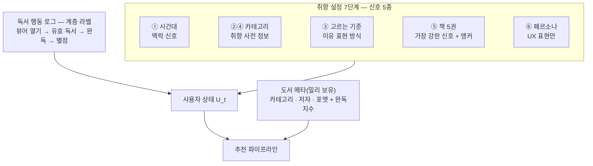

<objective>
`report/draft.md` 1~4장을 **처음 보는 IT 면접관이 읽는 제출 원고**로 압축·정리한다. 개발 과정 표기를 전부 지우고, 필수 문장을 본문으로 승격하고, 4장 해석을 5문장으로 줄이고, 그림 번호와 H2 축 태그를 일관되게 붙인다. 5장은 건드리지 않는다(08-02 몫).

Purpose: Phase 8 'PDF 제출물'(`.planning/ROADMAP.md` "### Phase 8: PDF 제출물") 성공 기준 1·2 — 페이지 매핑·숫자 출처(PDF-01)와 필수 문장·그림 4종(PDF-02)의 1~4장 몫.
Output: `report/draft.md` 1~4장 최종 형태(5장 미변경), `.planning/phases/08-pdf/08-01-SUMMARY.md`.
</objective>

<execution_context>
@$HOME/.claude/get-shit-done/workflows/execute-plan.md
@$HOME/.claude/get-shit-done/templates/summary.md
</execution_context>

<context>
@.planning/PROJECT.md
@.planning/ROADMAP.md
@.planning/STATE.md
@.planning/phases/08-pdf/08-CONTEXT.md
@report/draft.md
@../.claude/rules/report.md
@../.claude/rules/references.md
@results/latest_states.csv
@results/latest.csv
@results/latency.json
@results/millie_coverage.csv
@results/millie_edges_gate.json

<interfaces>
<!-- 이 페이즈는 코드를 만들지 않는다. 아래는 원고가 인용하는 숫자 정본의 현재 값 — 원고 안 숫자는 이 값과 글자 단위로 같아야 한다. -->

results/latest_states.csv (비교표 8행, 재측정 금지):
```
variant,state,recall@20,ndcg@10,ild@10,n_users
pop,n0,0.063,0.054,0.764,2000
pop,n20,0.080,0.087,0.746,1990
cf,n0,0.117,0.107,0.643,2000
cf,n20,0.207,0.237,0.738,1990
hybrid,n0,0.118,0.110,0.606,2000
hybrid,n20,0.204,0.240,0.717,1990
hybrid_div,n0,0.116,0.107,0.684,2000
hybrid_div,n20,0.205,0.238,0.780,1990
```
results/latest.csv = 위 n0 4행(split_mode holdout, n_users 2000) — `report/figures/eval_bar.png`(생성기 `src/millie_rec/evaluation/figures.py` `plot_eval_bar`)는 이 파일의 4 variant × 3지표 묶음 막대, 제목 "Track A (Goodbooks-10k, holdout, n_users=2000)".
results/latency.json: p95 79.517 → 원고 표기 **79.5ms**(n 500 · warmup 50 · users 50 · k 40 · variants hybrid_v1 250 + hybrid_div_v1 250 = 셀 혼합 전역).
results/millie_coverage.csv: completion_prob 0.8252 → **82.5%** · _n_records **9447**.
results/millie_edges_gate.json: same_category_share 0.3564 → **0.356** · n_books 9447.
</interfaces>
</context>

<tasks>

<task type="auto">
  <name>Task 1: 1·2장 — 조판 지시 삭제 · 데모 URL 1줄 · 4축 표 · 신호 그림 축약 · H2 축 태그 · 구현 현황 1문장</name>
  <files>report/draft.md</files>
  <read_first>
    - report/draft.md (전체 — 이 태스크가 다루는 1·2장은 파일 첫 줄부터 `# 3.` 직전까지. 아래 action의 줄 번호는 HEAD `aa5cc91` 기준 참고값이며 **반드시 인용한 문장 문자열로 찾는다**)
    - ../.claude/rules/report.md (장 구성 · 한 문단 3문장 이내 · 영어 용어 첫 등장 `용어(풀네임: 설명)` · 두 번째부터 약어만)
    - ../.claude/skills/pdf-check/SKILL.md (8-① "P1 첫 문단에 4축 각 한 문장" · 8-② "각 P의 H2에 축 태그 [①]~[④]")
    - .planning/phases/08-pdf/08-CONTEXT.md (D-04 · D-07 · D-08 · D-10 · D-13 — 이 태스크가 구현하는 결정. action에 내용을 풀어 썼으므로 대조용)
  </read_first>
  <action>
아래 순서대로 `report/draft.md`를 편집한다. 5장(`# 5.` 이후)은 건드리지 않는다.

**1-a. 조판 지시 블록 삭제(결정 D-10 '개발 과정 표기 전부 삭제', `.planning/phases/08-pdf/08-CONTEXT.md`).** 문서 제목 `# 밀리의서재 메인 영역 추천 시스템 설계` 바로 아래의 blockquote 2줄(`> 조판: Notion → PDF 내보내기 5장. …`과 `> 분량 배분(Notion 기준): …`)을 삭제한다. 그 아래 `---` 는 남긴다. 상단 체크리스트 표는 현재 없으니 **만들지 않는다**.

**1-b. 1장 제목 아래 데모 URL 1줄(결정 D-07 '데모 URL·QR·상태 페이지 박스 + 1장 제목 아래 URL 재기재').** `# 1. 추천 목표와 활용 데이터` 바로 다음 빈 줄 뒤에 다음 한 줄을 넣는다(해시 `/#/` 포함 그대로):
```
데모: https://millie-rec-production.up.railway.app/#/ (쇼케이스 화면에서 바로 눌러볼 수 있다 · 가동 감시 https://stats.uptimerobot.com/20M6QwPo7z)
```

**1-c. H2 축 태그(`/pdf-check` 8-②, 형식은 Claude's Discretion → H2 끝에 `[①②]`처럼 붙임).** 1·2장 H2 6개 중 5개를 다음으로 바꾼다(제목 본문은 유지, 끝에 태그만 추가 — 단 §2-1의 `(그림 1)`은 `(그림 2)`로, 이유는 1-e; §1-4는 1-e에서):
- `## 1-1. 한 줄 요약 [①]`
- `## 1-2. 문제 [①]`
- `## 1-3. 추천 목표 · 기대 효과 · 측정 지표 [①]`
- §1-4 H2는 1-e에서 `(그림 1) [②]`까지 한 번에 바꾼다(여기서는 건드리지 않는다)
- `## 2-1. 4단계 파이프라인 (그림 2) [③]`
- `## 2-2. 사용자 상태 — 시간에 따라 변하는 가중치 [②③]`

**1-d. 1장 첫 문단에 4축 각 한 문장(`/pdf-check` 8-①, 문단 3문장 규칙을 지키기 위해 표로).** §1-1의 기존 blockquote(`> 취향 설정으로 시작하되 …`)는 그대로 두고, 그 바로 아래에 리드 1문장과 표를 추가한다(리드 문장이 `/pdf-check` 8-①의 "첫 문단"이 된다):
```
과제의 네 축에 이 문서는 다음 한 문장씩으로 답한다.

| 축 | 한 문장 | 장 |
|---|---|---|
| ① 추천 목표 | 클릭이 아니라 QRS(Qualified Reading Start: 유효 독서 시작)를 올린다 | 1 |
| ② 활용 데이터 | 취향 설정 7단계의 신호 5종 + 독서 행동 로그 + 도서 메타(완독지수)를 서로 다른 신호로 쓴다 | 1 · 2 |
| ③ 추천 구조 | 후보 생성 → 순위화 → 재순위화 → 페이지 구성 4단계를 Offline · Nearline · Online 3계층 위에서 돌린다 | 2 · 3 |
| ④ 성능 평가 | Offline 3지표를 구조 3단계에 1:1로 붙이고 최종 판정은 A/B로 한다 | 4 |
```
이 표가 QRS의 **첫 등장**이 되므로, §1-3 표의 기술 행 `**QRS(Qualified Reading Start: 유효 독서 시작)** — 추천 노출 후 …`는 `**QRS** — 추천 노출 후 …`로 줄인다(두 번째부터 약어만).

**1-e. 그림 번호 재정렬.** 최종 체계: 1장 신호 그림 = 그림 1 · 2장 파이프라인 = 그림 2 · 3장 3계층 = 그림 3 · 4장 지표↔단계 = 그림 4 · 4장 비교 막대 = 그림 5 · 5장 캡처 그리드 = 그림 6(5장 몫은 08-02). 이 태스크에서는 §1-4 H2를 `## 1-4. 활용 데이터 — 취향 설정 7단계는 전부 다른 종류의 신호다 (그림 1) [②]`로 바꾸고, §2-1 H2의 `(그림 1)`을 `(그림 2)`로 바꾼다.

**1-f. 1장 mermaid 노드 축약(결정 D-08 'mermaid 4개 유지, 1장 신호 그림은 높이 약 1/3').** §1-4의 ```` ```mermaid ```` 블록(현재 `flowchart LR` 20줄, subgraph 3개)을 **다음 블록으로 통째로 교체**한다(3단 높이 · 노드 문구 축약):

표(`| 신호 | 어떻게 쓰나 | 쓰지 않는 방법 (흔한 실수) |`)는 그대로 둔다.

**1-g. "미선택 책은 negative가 아니다" 본문 승격(결정 D-13 '제목·표 셀에만 있는 필수 문장 2개를 본문으로').** §1-4 표 아래 문단 `취향 설정 화면 자체가 추천 데이터를 생성하는 정책이고 동시에 노출 편향의 원인이다. 따라서 …`의 **첫 문장**을 다음으로 바꾼다(나머지 2문장 유지 → 문단 3문장):
```
취향 설정 화면은 추천 데이터를 만드는 정책이자 노출 편향의 원인이라 **미선택 책은 negative가 아니다** — 노출 위치 때문에 못 본 것일 뿐이다.
```
§1-4 표 셀의 `✗ **미선택 책을 부정 신호로 사용**`은 그대로 둔다.

**1-h. 2장 구현 현황 1문장(결정 D-04 '구현 현황 문단 2개는 각 1문장').** §2-2 마지막 문단 `**구현 현황.** 파이프라인 단계 = 코드 폴더(\`data/ retrieval/ …\`). … 완료(Phase 4).`를 **통째로** 다음 한 문장으로 바꾼다(파일 경로·Phase 번호 삭제):
```
**구현.** 파이프라인 4단계가 코드 폴더와 1:1이고 경계는 아키텍처 테스트가 강제한다.
```

**1-i. 마무리 검사.** 1·2장 범위(`# 3.` 이전)에서 `Phase [0-9]`·`Day [0-9]`·`freeze`·`구현 완료`·`make serve`·`[Phase`·`[재확인]`이 0건인지 확인한다. 2장의 `**구현 결정.** α/β/γ는 …` 문단은 유지한다(설계 설명이며 개발 과정 표기가 아님).
  </action>
  <verify>
    <automated>cd /Users/shinwonchul/Documents/신원철/밀리의서재/millie-rec && test "$(grep -c '^> 조판:' report/draft.md)" = 0 && test "$(grep -c 'https://millie-rec-production.up.railway.app/#/' report/draft.md)" -ge 1 && test "$(awk '/^# 1\./{f=1} /^# 3\./{f=0} f' report/draft.md | grep -cE 'Phase [0-9]|Day [0-9]|freeze|구현 완료|make serve|\[Phase|\[재확인\]')" = 0 && test "$(awk '/^# 1\./{f=1} /^# 3\./{f=0} f' report/draft.md | grep -E '^## ' | grep -vcE '\[[①②③④]+\]$')" = 0 && test "$(awk '/^```mermaid/{c++} c==1&&/^```mermaid/,c==1&&/^```$/' report/draft.md | wc -l | tr -d ' ')" -le 14 && grep -v '^#' report/draft.md | grep -v '^|' | grep -c '미선택 책은 negative가 아니다' | grep -q '^[1-9]' && echo PASS</automated>
  </verify>
  <acceptance_criteria>
    - `grep -c '^> 조판:' report/draft.md` = 0 그리고 `grep -c '^> 분량 배분' report/draft.md` = 0 (L3~4 블록 삭제)
    - `grep -c 'https://millie-rec-production.up.railway.app/#/' report/draft.md` ≥ 1 이고 그 줄이 `# 1.` H1 다음 5줄 안에 있다: `awk '/^# 1\./{f=1;n=0} f{n++; if(n<=5 && /railway.app\/#\//) print "OK"}' report/draft.md` 출력에 `OK` 포함
    - `grep -c '^과제의 네 축에 이 문서는 다음 한 문장씩으로 답한다\.$' report/draft.md` = 1 (리드 문장) · `grep -c '^| ① 추천 목표 |' report/draft.md` = 1 · `grep -c '^| ④ 성능 평가 |' report/draft.md` = 1 (4축 표)
    - `grep -c 'QRS(Qualified Reading Start: 유효 독서 시작)' report/draft.md` = 1 (첫 등장 1회만)
    - `awk '/^# 1\./{f=1} /^# 3\./{f=0} f' report/draft.md | grep -E '^## ' | grep -vcE '\[[①②③④]+\]$'` = 0 그리고 같은 범위 `grep -c '^## '` = 6
    - `grep -c '## 1-4\. .*(그림 1) \[②\]' report/draft.md` = 1 · `grep -c '## 2-1\. .*(그림 2) \[③\]' report/draft.md` = 1
    - 첫 mermaid 블록 줄 수(펜스 포함) ≤ 14: `awk '/^```mermaid/{c++} c==1&&/^```mermaid/,c==1&&/^```$/' report/draft.md | wc -l` ≤ 14, 그리고 `grep -c '^```mermaid' report/draft.md` = 4 (그림 수 불변)
    - `grep -v '^#' report/draft.md | grep -v '^|' | grep -c '미선택 책은 negative가 아니다'` ≥ 1 (본문 줄)
    - `grep -c '^\*\*구현\.\*\* 파이프라인 4단계가 코드 폴더와 1:1이고 경계는 아키텍처 테스트가 강제한다\.' report/draft.md` = 1 · `grep -c '구현 현황' report/draft.md`의 2장 범위 값 = 0
    - `awk '/^# 1\./{f=1} /^# 3\./{f=0} f' report/draft.md | grep -cE 'Phase [0-9]|Day [0-9]|freeze|구현 완료|make serve|\[Phase|\[재확인\]'` = 0
    - 필수 문장 ①·② 보존(본문 줄): `B=$(grep -v '^#' report/draft.md | grep -v '^|')` 에서 `echo "$B" | grep -c 'CTR(Click-Through Rate: 클릭률)은 진단 지표이지 목적이 아니다'` ≥ 1 · `echo "$B" | grep -c '취향 재설정 ≠ 프로필 초기화'` ≥ 1
    - `awk '/^# 3\./{f=1} /^# 5\./{f=0} f' report/draft.md`(3·4장)과 `awk '/^# 5\./{f=1} f' report/draft.md`(5장)는 이 태스크 전후로 `diff` 없음(범위 밖 무변경)
  </acceptance_criteria>
  <done>1·2장에 개발 과정 표기 0건, 데모 URL 1줄·4축 표·축 태그 6개·축약 mermaid·구현 1문장·미선택 본문 문장이 존재하고 3~5장은 바이트 동일.</done>
</task>

<task type="auto">
  <name>Task 2: 3장 — 필수 문장 승격·분리 · 구현 현황 1문장 · §3-3 실측 불릿 → 각주 2줄 · H2 축 태그</name>
  <files>report/draft.md</files>
  <read_first>
    - report/draft.md (`# 3.`부터 `# 4.` 직전까지 — 문장 문자열로 위치를 찾는다)
    - ../.claude/rules/report.md (필수 문장 7개 목록 · 데이터 2트랙 명시 · 한 문단 3문장)
    - .planning/phases/08-pdf/08-CONTEXT.md (D-02 · D-04 · D-10 · D-13 — action에 문장을 풀어 썼으므로 대조용)
    - results/millie_coverage.csv · results/millie_edges_gate.json (각주 숫자 82.5% · 9,447 · 0.356 정본)
  </read_first>
  <action>
`report/draft.md` 3장(`# 3. 기술 스택과 시스템 아키텍처` ~ `# 4.` 직전)만 편집한다.

**2-a. H2 축 태그 + 그림 번호.**
- `## 3-1. 운영 3계층 — 요청마다 무거운 계산을 다시 하지 않는다 (그림 2)` → `## 3-1. 운영 3계층 (그림 3) [③]` (문장은 2-b에서 본문으로 내려간다)
- `## 3-2. 기술 스택과 선택 이유` → `## 3-2. 기술 스택과 선택 이유 [③]`
- `## 3-3. 실서비스 ↔ 5일 데모 대응` → `## 3-3. 실서비스 ↔ 데모 대응 [③]` ("5일"은 개발 과정 표기라 뺀다)

**2-b. 필수 문장 ③ 본문 승격(결정 D-13).** 계층 표(`| **Online** | 요청 시 | …`) 아래 문단 `**계층 배치의 기준은 지연 예산이다.** 추천 API p95 200ms(…)를 단계별로 쪼갰고 … **추천 API 장애가 메인 장애가 되어선 안 된다.**`를 **통째로** 다음 문단(3문장)으로 바꾼다. 마지막 문장이던 `**추천 API 장애가 메인 장애가 되어선 안 된다.**`는 이 문단에서 빼고 2-c의 구현 문단 첫 문장으로 옮긴다:
```
**요청마다 무거운 계산을 다시 하지 않는다** — 계층 배치의 기준은 지연 예산이다. 추천 API p95 200ms(과제용 제안 SLO(Service Level Objective: 서비스 수준 목표); 내부 값 비공개)를 단계별로 쪼갰고 예산을 넘는 연산은 전부 Offline·Nearline으로 내렸다. 예산을 넘거나 예외가 나면 fallback cascade(단계적 대체) 0→3으로 내려간다.
```

**2-c. 구현 현황 1문장(결정 D-04).** 문단 `**구현 현황.** 파이프라인이 예외를 던져도 \`GET /api/recommend\`는 500 대신 **200 + fallback 3단계 + 인기 행**을 반환한다(\`tests/serving/test_smoke.py\`). 모델·아티팩트 없이 \`make serve\`만으로 … 위 원칙이 테스트로 존재한다.`를 **통째로** 다음으로 바꾼다(`make serve` 삭제, 테스트 이름 1개는 결정 D-10 '산출물 근거만 각주로 유지'에 따라 남김):
```
**추천 API 장애가 메인 장애가 되어선 안 된다.** 파이프라인이 예외를 던져도 200 + 인기 행을 반환하는 것이 테스트로 존재한다(`tests/serving/test_smoke.py`의 fallback 200 테스트).
```

**2-d. Two-Tower·LLM 미채택 이유를 각 1문장으로 분리(결정 D-13).** §3-2 표 아래 문단 `**의도적으로 넣지 않은 것과 이유.** **LLM(Large Language Model)** — … 안 쓴 이유를 밝히는 것이 쓰는 것보다 판단을 더 잘 보여준다.`를 **통째로** 다음 문단으로 바꾼다(첫 등장 용어 형식 유지 — Two-Tower·ANN은 위 표에서 이미 풀네임이 나왔으므로 약어만):
```
**의도적으로 넣지 않은 것.** LLM(Large Language Model: 대규모 언어 모델)은 넣지 않았다 — 이 문제의 본질은 추천이고, LLM은 도서 소개 임베딩 같은 오프라인 표현 생성에만 쓸 여지가 있다. Two-Tower는 넣지 않았다 — 수십만 권 규모에서 Item-KNN 대비 이득이 작고 같은 이웃 행렬이 추천 이유("『○○』을 좋아하셨다면")까지 설명하는 장점을 잃는다. ALS(Alternating Least Squares: 행렬 분해 협업 필터링)도 빌드 리스크 대비 Item-KNN과 설명력 차이가 작아 뺐다 — 안 쓴 이유를 밝히는 것이 쓰는 것보다 판단을 더 잘 보여준다.
```
(3장 표 L156 배포·관측 행의 "데모에서는 관제 화면이 서버 로그를 직접 집계한다"는 유지.)

**2-e. §3-3 실측 불릿 2개 → 각주 2줄(결정 D-02 '§3-3 불릿 2개는 각주 2줄로 압축').** 대응표 아래 `- (Day 1 실측, Phase 3 '밀리 카탈로그 빌드') 데모 카탈로그 = …`와 `- (Day 2·Day 4 실측, Phase 7 '배포') 같은 이미지가 …` 불릿 2개를 **통째로 삭제**하고 다음 2줄로 바꾼다(수집일·파일명·5초 폴링·다운타임 초·`artifacts/serving/books_kr.json`·SVD 128 전부 삭제):
```
각주 — 데모 카탈로그는 밀리 공개 도서 페이지 9,447권(수치·메타·표지 URL만 저장, 리뷰 텍스트 미저장)이고 완독지수 커버리지는 82.5%다(`results/millie_coverage.csv`). 앵커 이웃은 제목·소개 TF-IDF cosine이고 동일 카테고리 비율은 0.356이다(`results/millie_edges_gate.json`). 협업 필터링 수치는 Goodbooks에서만 측정하며 두 트랙의 숫자는 한 표에 섞지 않는다.
각주 — 같은 컨테이너 이미지가 로컬 docker와 Railway에서 동일하게 뜨고(`/health`의 `model_version` 일치), 재배포 중에도 SQLite 볼륨은 유지된다. 가동은 5분 간격 헬스체크로 감시한다.
```

**2-f. 마무리 검사.** 3장 범위에서 `Phase [0-9]`·`Day [0-9]`·`freeze`·`구현 완료`·`make serve`·`5일`이 0건인지 확인한다. §3-2 표 열 제목 `5일 MVP (구현)`은 `MVP (구현)`으로 바꾼다.
  </action>
  <verify>
    <automated>cd /Users/shinwonchul/Documents/신원철/밀리의서재/millie-rec && R="$(awk '/^# 3\./{f=1} /^# 4\./{f=0} f' report/draft.md)" && test "$(echo "$R" | grep -cE 'Phase [0-9]|Day [0-9]|freeze|구현 완료|make serve|5일')" = 0 && test "$(echo "$R" | grep -E '^## ' | grep -vcE '\[[①②③④]+\]$')" = 0 && echo "$R" | grep -v '^#' | grep -c '요청마다 무거운 계산을 다시 하지 않는다' | grep -q '^[1-9]' && test "$(echo "$R" | grep -c '^각주 — ')" = 2 && echo "$R" | grep -q 'Two-Tower는 넣지 않았다' && echo "$R" | grep -q 'LLM(Large Language Model: 대규모 언어 모델)은 넣지 않았다' && echo PASS</automated>
  </verify>
  <acceptance_criteria>
    - 3장 범위 `R=$(awk '/^# 3\./{f=1} /^# 4\./{f=0} f' report/draft.md)`에서 `echo "$R" | grep -cE 'Phase [0-9]|Day [0-9]|freeze|구현 완료|make serve|5일'` = 0
    - `echo "$R" | grep -c '^## 3-1\. 운영 3계층 (그림 3) \[③\]$'` = 1 · `grep -c '^## 3-2\. .*\[③\]$'` = 1 · `grep -c '^## 3-3\. 실서비스 ↔ 데모 대응 \[③\]$'` = 1
    - `echo "$R" | grep -v '^#' | grep -v '^|' | grep -c '요청마다 무거운 계산을 다시 하지 않는다'` ≥ 1 (본문 줄) · `echo "$R" | grep -c '^\*\*요청마다 무거운 계산을 다시 하지 않는다\*\* — 계층 배치의 기준은 지연 예산이다\.'` = 1
    - `echo "$R" | grep -c '^\*\*추천 API 장애가 메인 장애가 되어선 안 된다\.\*\* 파이프라인이 예외를 던져도 200 + 인기 행을 반환하는 것이 테스트로 존재한다'` = 1 · `echo "$R" | grep -c '구현 현황'` = 0
    - `B3=$(echo "$R" | grep -v '^#' | grep -v '^|')` 에서 `echo "$B3" | grep -c 'LLM(Large Language Model: 대규모 언어 모델)은 넣지 않았다'` = 1 · `grep -c 'Two-Tower는 넣지 않았다'` = 1 · `grep -c 'ALS(Alternating Least Squares: 행렬 분해 협업 필터링)'` = 1 · `grep -c '추천 API 장애가 메인 장애가 되어선 안 된다'` ≥ 1 — 세 문장이 같은 문단(연속 줄 1개)에 있다: `echo "$R" | grep -c '^\*\*의도적으로 넣지 않은 것\.\*\*'` = 1
    - `echo "$R" | grep -c '^각주 — '` = 2 · `echo "$R" | grep -c '^- (Day'` = 0 · 각주 1에 `9,447권`·`82.5%`·`0.356`·`results/millie_coverage.csv`·`results/millie_edges_gate.json` 각 1회 · 각주 2에 `model_version`·`SQLite 볼륨` 각 1회
    - `echo "$R" | grep -cE '2026-09-0[0-9]|books_kr\.json|SVD 128|5초 폴링|30~40초|5~15초'` = 0
    - `grep -c '^```mermaid' report/draft.md` = 4 (3장 mermaid 무변경)
    - 1·2장(`awk '/^# 1\./{f=1} /^# 3\./{f=0} f'`)과 4·5장(`awk '/^# 4\./{f=1} f'`)은 이 태스크 전후 `diff` 없음
  </acceptance_criteria>
  <done>3장에 개발 과정 표기 0, 필수 문장 ③·④·⑤·⑥이 각각 본문 문장으로 존재, §3-3 아래는 각주 2줄, H2 3개에 축 태그.</done>
</task>

<task type="auto">
  <name>Task 3: 4장 — 비교표 8행 유지 · 해석 5문장 · 고정 상수 각주 1줄 · 비교 막대 자리 표시 · 모니터링 행 · 전역 p95 구절 · H2 축 태그</name>
  <files>report/draft.md</files>
  <read_first>
    - report/draft.md (`# 4.`부터 `# 5.` 직전까지)
    - results/latest_states.csv · results/latest.csv · results/latency.json (숫자 정본 — 해석 문장의 숫자는 여기서만)
    - report/figures/eval_bar.png (Read 도구로 이미지를 열어 막대 위 수치 라벨 12개가 `results/latest.csv`의 값과 같은지 눈으로 대조 — **재생성 금지**, 숫자는 고정)
    - .planning/phases/07-deploy/07-04-SUMMARY.md ("Task 2 — Codex" 표의 C5 행: 전역 p95 문구 정정 인계)
    - .planning/phases/08-pdf/08-CONTEXT.md (D-01 · D-10 · D-15 — 대조용)
  </read_first>
  <action>
`report/draft.md` 4장(`# 4. 성능 평가 방법` ~ `# 5.` 직전)만 편집한다.

**3-a. H2 축 태그 + 그림 번호.**
- `## 4-1. Offline — 지표 3개가 구조 3단계와 1:1 (그림 3)` → `## 4-1. Offline — 지표 3개가 구조 3단계와 1:1 (그림 4) [④]`
- `## 4-2. Online — A/B 테스트가 최종 판정` → `## 4-2. Online — A/B 테스트가 최종 판정 [④]`
- `## 4-3. 실서비스 제약 → 설계 결정 (제약이 아키텍처를 결정했다)` → `## 4-3. 실서비스 제약 → 설계 결정 [③④]`

**3-b. 회사 수치 제거(결정 D-14 '회사 수치 [재확인] 제거' · 위협 T-08-05).** mermaid 아래 문단 `… 다양성(ILD)은 24만 권 카탈로그를 활용하기 위한 제품 지표다.`에서 `24만 권 카탈로그`를 `수십만 권 카탈로그`로 바꾼다(회사 공식 수치는 재확인 없이 인용하지 않는다).

**3-c. 실측 표 머리말.** `**실측 (Phase 4 완료, \`results/latest_states.csv\` · Goodbooks-10k · holdout)**` → `**실측 (\`results/latest_states.csv\` · Goodbooks-10k · holdout · seed 42)**`. 비교표 **8행은 그대로 유지**(결정 D-01 '비교표 8행 유지'). 표 안 오타 `콘텍츠`(hybrid 2행) → `콘텐츠`.

**3-d. 비교 막대 자리 표시(수용 기준 PDF-02 '그림 4종 — 비교 막대', `.planning/REQUIREMENTS.md`).** 비교표 마지막 행(`| hybrid_div (+다양성·난이도 가드) | 이력 축적 (n≥20) | 0.205 | 0.238 | 0.780 | 1,990 |`) 바로 아래 빈 줄 뒤에 다음 2줄을 넣는다:
```
(그림 5 · 비교 막대 — `report/figures/eval_bar.png`, Notion 삽입 · 폭 1/2)
그림 5. 온보딩 직후(n=0) 상태의 4 variant × Recall@20·NDCG@10·ILD@10(`results/latest.csv`, Goodbooks-10k · holdout · n=2,000). 위 표의 n=0 4행과 같은 숫자다.
```
`report/figures/eval_bar.png`를 Read로 열어 막대 라벨(pop 0.063/0.054/0.764 · cf 0.117/0.107/0.643 · hybrid 0.118/0.110/0.606 · hybrid_div 0.116/0.107/0.684)이 `results/latest.csv`와 같은지 확인하고 결과를 SUMMARY에 1줄 기록한다. 다르면 **재생성하지 말고** 불일치를 SUMMARY에 적어 Advisor에게 넘긴다.

**3-e. 해석 3문단 → 5문장(결정 D-01 '해석 문단 3개(2,442자)를 5문장으로').** 비교표 아래의 세 문단 — `같은 모델을 **온보딩 직후(n=0)와 이력 축적(n≥20) 두 상태에서 따로 측정**하는 이유는 …`(해석) · `**측정 설계.** cf는 Item-KNN(…)`(측정 설계) · `각주 — Goodbooks-10k(CC BY-SA 4.0) · … 세부 분류 가점 0.06.`(각주) — 를 **통째로 삭제**하고, 3-d의 그림 캡션 아래에 다음을 넣는다(문단 2개 = 5문장 + 각주 2줄):
```
같은 모델을 온보딩 직후(n=0)와 이력 축적(n≥20)에서 따로 측정한 이유는 §2-2 "가중치가 변해야 한다"를 숫자로 보이기 위해서다. n≥20에서 NDCG@10은 pop 0.087 대 hybrid 0.240으로 격차 0.153이 나서 이력 성분 β가 순위화에 들어온다는 주장의 실측 증거가 되며, 같은 상태의 cf 0.237과 hybrid의 차이는 0.003으로 작다. pop 기준선의 두 값 차이는 추천 제외 범위(n=0은 5권만, n≥20은 이력 전체)에서 온 바닥선이라 모델 성능과 무관하다.

MMR 재순위화(λ=0.7)로 n=0에서 NDCG@10은 0.110→0.107로 2.7% 내렸지만 ILD@10은 0.606→0.684로 올랐고, 통과 기준(ILD@10 상승 ∧ NDCG@10 하락 20% 이내)을 만족해 상수를 조정 없이 고정했다. 데모 카탈로그(밀리)에는 사용자 로그가 없어 협업 채널 자리에 콘텐츠 유사도 이웃이 들어가고 그 숫자는 이 표에 넣지 않는다.

각주 — Goodbooks-10k(CC BY-SA 4.0) · 유저·아이템 ≥5 필터 · 유저별 holdout 20% · 테스트 2,000명(seed 42) · 정답 = 평점 ≥4 · 온보딩 시뮬레이션 = 학습 긍정 중 무작위 5권을 seeds로 · hybrid = 채널별 min-max 정규화 후 가중합(협업 0.5 · 콘텐츠 0.3 · 인기 0.2). 타임스탬프가 없어 무작위 분할을 썼으나 **실서비스 평가는 반드시 temporal split(시간순 분할)**로 미래 정보 누수를 막는다. 비교표는 공개 데이터, 데모 카탈로그·난이도·본인 5권은 밀리 표본이며 두 숫자를 한 표에 섞지 않는다.
각주 — 고정 상수: Item-KNN 이웃 50 · 후보 풀 채널별 200 · MMR 풀 50 · λ=0.7 · α₀/β₀/γ₀=0.6/0.3/0.1 · τ=20 · α 하한 0.2 · 세부 분류 가점 0.06.
```
(영어 "freeze"는 쓰지 않는다. 모델 간 비교는 화살표(→) 대신 "pop 0.087 대 hybrid 0.240"처럼 병렬 표기한다 — 화살표는 같은 모델의 상태 변화(0.110→0.107)에만 쓴다. 숫자는 위 `<interfaces>`의 정본과 글자 단위로 같다: 0.153 = 0.240−0.087, 0.003 = 0.240−0.237, 2.7% = (0.110−0.107)/0.110.)

**3-f. §4-3 표 정리(결정 D-15 '모니터링 행 문구' + Codex 2회차 C5 '전역 p95' 문구, `.planning/phases/07-deploy/07-04-SUMMARY.md` "Task 2 — Codex" 표).**
- 응답 지연 행의 증거 셀 `Phase 1 테스트 · 로컬 bench p95 **79.5ms**(user_key 50·warmup 50·500요청·k 40, \`results/latency.json\`)` → `fallback 200 테스트 · 로컬 bench p95 **79.5ms**(variant 공통 전역 p95 — 셀 혼합 bench · 사용자 50 · warmup 50 · 500요청 · k 40, \`results/latency.json\`)`
- 데이터 품질 행의 증거 셀 `Phase 2 dedupe · 평가/서빙 공용 \`StagedPipeline\`` → `멱등 dedupe 테스트 · 평가/서빙 공용 \`StagedPipeline\``
- 모니터링 행 전체를 다음으로 바꾼다:
```
| **모니터링** | 예외는 Sentry, 가동은 5분 간격 헬스체크, 추천 품질은 Offline 3지표 추이·drift·신규/기존 분리로 본다 | Sentry(예외) 연결 · 가동 감시 5분 · 지표 수집기(Prometheus→Grafana)는 설계만 |
```
(`/metrics` Bearer · `prometheus-client` · `GET /api/dashboard` 언급은 삭제.)

**3-g. 마무리 검사.** 4장 범위에서 `Phase [0-9]`·`Day [0-9]`·`freeze`·`구현 완료`·`make serve`·`24만`이 0건인지 확인한다. 4장 mermaid 블록은 건드리지 않는다.
  </action>
  <verify>
    <automated>cd /Users/shinwonchul/Documents/신원철/밀리의서재/millie-rec && R="$(awk '/^# 4\./{f=1} /^# 5\./{f=0} f' report/draft.md)" && test "$(echo "$R" | grep -cE 'Phase [0-9]|Day [0-9]|freeze|구현 완료|make serve|24만')" = 0 && test "$(echo "$R" | grep -c '^| hybrid_div (+다양성·난이도 가드) |')" = 2 && test "$(echo "$R" | grep -cE '^\| (pop|cf|hybrid|hybrid_div) ')" = 8 && echo "$R" | grep -q 'eval_bar.png' && echo "$R" | grep -q '^그림 5\. ' && test "$(echo "$R" | grep -c '^각주 — 고정 상수: ')" = 1 && echo "$R" | grep -q '지표 수집기(Prometheus→Grafana)는 설계만' && echo "$R" | grep -q 'variant 공통 전역 p95' && test "$(echo "$R" | grep -E '^## ' | grep -vcE '\[[①②③④]+\]$')" = 0 && echo PASS</automated>
  </verify>
  <acceptance_criteria>
    - 4장 범위 `R=$(awk '/^# 4\./{f=1} /^# 5\./{f=0} f' report/draft.md)`에서 `grep -cE 'Phase [0-9]|Day [0-9]|freeze|구현 완료|make serve|24만'` = 0
    - 비교표 8행 유지: `echo "$R" | grep -cE '^\| (pop|cf|hybrid|hybrid_div) '` = 8, 그리고 `echo "$R" | grep -c '0.240'` ≥ 2(표 + 해석) · `grep -c 'pop 0.087 대 hybrid 0.240'` = 1 · `grep -c '0.087→0.240'` = 0 · `grep -c 'cf 0.237과 hybrid의 차이는 0.003'` = 1 · `grep -c '0.780'` = 1 · `grep -c '콘텍츠'` = 0
    - `echo "$R" | grep -c 'report/figures/eval_bar.png'` = 1 · `grep -c '^그림 5\. 온보딩 직후(n=0) 상태의 4 variant'` = 1 · `grep -c 'results/latest.csv'` ≥ 1
    - 해석은 5문장: 그림 5 캡션과 첫 `각주 — ` 사이의 비어 있지 않은 줄 2개의 한국어 종결(`다\.`) 개수 합 = 5: `echo "$R" | awk '/^그림 5\./{f=1;next} /^각주 — /{f=0} f&&NF' | grep -o '다\.' | wc -l` = 5
    - `echo "$R" | grep -c '^각주 — Goodbooks-10k(CC BY-SA 4.0)'` = 1 · `grep -c '^각주 — 고정 상수: Item-KNN 이웃 50 · 후보 풀 채널별 200 · MMR 풀 50 · λ=0.7 · α₀/β₀/γ₀=0.6/0.3/0.1 · τ=20 · α 하한 0.2 · 세부 분류 가점 0.06\.$'` = 1 · `grep -c '측정 설계'` = 0
    - `echo "$R" | grep -c 'temporal split(시간순 분할)'` = 1 · `grep -c '두 숫자를 한 표에 섞지 않는다'` = 1 (2트랙 각주 보존)
    - `echo "$R" | grep -c '| \*\*모니터링\*\* | 예외는 Sentry, 가동은 5분 간격 헬스체크'` = 1 · `grep -c '지표 수집기(Prometheus→Grafana)는 설계만'` = 1 · `grep -cE 'prometheus-client|/metrics|/api/dashboard'` = 0
    - `echo "$R" | grep -c 'variant 공통 전역 p95'` = 1 · `grep -c '79.5ms'` = 1 · `grep -c 'fallback 200 테스트'` = 1 · `grep -c 'test_delete_personalization_then_level3_until_reconsent'` = 1 (D-10 테스트 이름 1~2개 유지)
    - `echo "$R" | grep -c '^## 4-1\. .*(그림 4) \[④\]$'` = 1 · `grep -c '^## 4-2\. .*\[④\]$'` = 1 · `grep -c '^## 4-3\. 실서비스 제약 → 설계 결정 \[③④\]$'` = 1
    - `grep -c '^```mermaid' report/draft.md` = 4 · 전체 `grep -o '그림 [0-9]' report/draft.md | sort -u`에 `그림 1` `그림 2` `그림 3` `그림 4` `그림 5`가 모두 있다
    - 1~3장(`awk '/^# 1\./{f=1} /^# 4\./{f=0} f'`)·5장(`awk '/^# 5\./{f=1} f'`)은 이 태스크 전후 `diff` 없음
    - SUMMARY에 eval_bar.png 12개 라벨 vs `results/latest.csv` 대조 결과 1줄
  </acceptance_criteria>
  <done>4장 비교표 8행 유지 + 그림 5 자리 표시·캡션 + 해석 5문장 + 각주 2줄(측정 조건·고정 상수) + 모니터링·전역 p95 문구 + 축 태그, 개발 과정 표기 0.</done>
</task>

</tasks>

<threat_model>
## Trust Boundaries

| Boundary | Description |
|----------|-------------|
| draft.md → PDF(심사자, 외부 공개) | 원고 문장이 그대로 외부로 나간다 — 저작권·회사 수치·내부 경로가 이 경계를 넘으면 회수 불가 |
| 작업 트리 → git(public repo) | 다른 세션의 미커밋 리뷰 파일이 섞이면 공개된다 (이 플랜은 커밋하지 않음 — 08-05) |

## STRIDE Threat Register

| Threat ID | Category | Component | Disposition | Mitigation Plan |
|-----------|----------|-----------|-------------|-----------------|
| T-08-01 | I (정보 노출) | draft.md — 과제 PDF 원문 문구 인용 | mitigate | 원고 문장은 전부 설계서·CONTEXT 유래. 08-03 Task 1 acceptance `grep -c '\.assets' report/draft.md` = 0 · 과제 PDF 파일명 grep 0 |
| T-08-02 | I | draft.md — 밀리 저작 텍스트(리뷰·책 소개) | mitigate | 각주 문구 "리뷰 텍스트 미저장" 유지 · 책 소개 문장 인용 없음(Task 2 acceptance 각주 문자열 고정) |
| T-08-03 | I | draft.md — `.assets/` 경로·표지 이미지 | mitigate | 그림은 `report/figures/` 자리 표시만(Task 3-d) · `grep -c '\.assets' report/draft.md` = 0 |
| T-08-05 | R (부인 방지 — 검증 불가 수치) | draft.md — 회사 수치 미확인 인용 | mitigate | Task 3-b `24만 권` → `수십만 권`, acceptance `grep -c '24만'` = 0 |
| T-08-07 | T (변조) | draft.md — 숫자가 `results/`와 어긋남 | mitigate | Task 3 해석·각주 숫자를 `<interfaces>` 정본과 글자 단위 일치, 재측정·재생성 금지, eval_bar.png 라벨 육안 대조 |
</threat_model>

<verification>
- `grep -c "^# [1-5]\." report/draft.md` = 5 · `grep -c '^```mermaid' report/draft.md` = 4
- `awk '/^# 1\./{f=1} /^# 5\./{f=0} f' report/draft.md | grep -cE "Phase [0-9]|Day [0-9]|freeze|구현 완료|make serve|\[Phase|\[재확인\]|24만|5일"` = 0
- 필수 문장 6개(5장 몫 제외) 본문 줄 존재: `grep -v '^#' report/draft.md | grep -v '^|'` 결과에서 `CTR(Click-Through Rate: 클릭률)은 진단 지표이지 목적이 아니다` · `취향 재설정 ≠ 프로필 초기화` · `요청마다 무거운 계산을 다시 하지 않는다` · `추천 API 장애가 메인 장애가 되어선 안 된다` · `Two-Tower는 넣지 않았다` · `LLM(Large Language Model: 대규모 언어 모델)은 넣지 않았다` · `미선택 책은 negative가 아니다` 각 `grep -c` ≥ 1
- 1~4장 H2 12개 전부 `\[[①②③④]+\]$`로 끝남
- 5장(`awk '/^# 5\./{f=1} f' report/draft.md`)은 HEAD `aa5cc91`과 `diff` 없음: `diff <(git show aa5cc91:report/draft.md | awk '/^# 5\./{f=1} f') <(awk '/^# 5\./{f=1} f' report/draft.md)` 빈 출력
</verification>

<success_criteria>
- 1~4장이 결정 D-01 · D-02 · D-04 · D-07(1장 URL) · D-08 · D-10 · D-13 · D-14(회사 수치) · D-15(`.planning/phases/08-pdf/08-CONTEXT.md`)를 위 acceptance_criteria의 grep으로 증명한다.
- 비교 막대(그림 5) 자리 표시가 있어 수용 기준 PDF-02의 그림 4종 중 3종(아키텍처 · 단계↔지표 · 비교 막대)이 1~4장에 존재한다.
- 5장은 무변경(08-02 입력 보존).
</success_criteria>

<output>
After completion, create `.planning/phases/08-pdf/08-01-SUMMARY.md` — 바뀐 절 목록 · eval_bar.png 대조 결과 1줄 · 장별 한글 자수(D-16 Python 1줄 출력) 전/후 · 커밋 없음(08-05에서 일괄, 사용자 승인 후).
</output>

## 결정 ↔ 태스크 매핑 (Phase 8 전체, `.planning/phases/08-pdf/08-CONTEXT.md`)

| 결정 | 내용 한 줄 | 구현 태스크 |
|---|---|---|
| D-01 | 4장 비교표 8행 유지 · 해석 5문장 · 고정 상수 각주 1줄 | **08-01 Task 3** |
| D-02 | 3장 §3-3 불릿 2개 → 각주 2줄 | **08-01 Task 2** |
| D-03 | 5장 ★ callout 3 + 난이도 4층 표 | 08-02 Task 2 |
| D-04 | 2·3장 구현 현황 각 1문장 | **08-01 Task 1 · Task 2** |
| D-05 | 감축 목표(한글 자수 실측 기준, 정정): 3장 ≤1,100 · 4장 ≤1,150 · 5장 산문 ≤1,100 · 1·2장 유지 · 최종 게이트 = 사용자 Notion 장 수 | 08-03 Task 1 (계측·차순 삭제) |
| D-06 | 캡처 6장 3×2 그리드 · 캡션 1:1 · 파일은 repo 밖 | 08-02 Task 1 |
| D-07 | 데모 URL·QR·상태 페이지 박스 + 1장 URL 재기재 | **08-01 Task 1(1장)** · 08-02 Task 1(5장) |
| D-08 | mermaid 4개 유지 · 1장 노드 축약 | **08-01 Task 1** |
| D-09 | 5권 소형 표 + 이웃 성격 1줄 · 과대 표기 수정 | 08-02 Task 2 |
| D-10 | 개발 과정 표기 전부 삭제 · 출처·테스트 이름만 유지 | **08-01 Task 1·2·3** · 08-02 Task 1·2 |
| D-11 | 시나리오 3문장 + 캡션 1:1 | 08-02 Task 1 |
| D-12 | 완독 직후 행 + 1탭 별점 보충(모델 입력은 설계만) | 08-02 Task 1 |
| D-13 | 필수 문장 승격 2 · Two-Tower/LLM 분리 | **08-01 Task 1(미선택) · Task 2(재계산·분리)** |
| D-14 | 문체 규칙 · 회사 수치 제거 | **08-01 Task 3(24만)** · 08-03 Task 3(humanize) |
| D-15 | 모니터링 행 문구 · 전역 p95 구절 | **08-01 Task 3** |
| D-16 | 분량 계측 + 사용자 Notion 장 수 회신 | 08-03 Task 1·2 · 08-04 Task 2·3 |
| D-17 | Sentry 정상 동작 확인(사용자 회신 → 필요 시 probe) | 08-04 Task 2·3 |
| D-18 | 제출 전 점검 목록 | 08-04 Task 1 · 08-05 |
| D-19 | 완독 후 추천 유저 플로우(5장 클릭 경로 1줄 · 캡션 단계 번호 · demo_guide §6) | 08-02 Task 1 |
