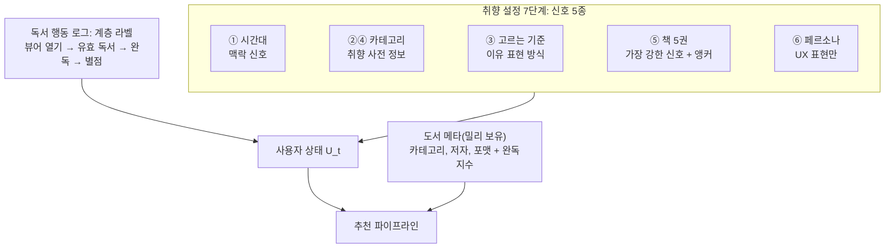
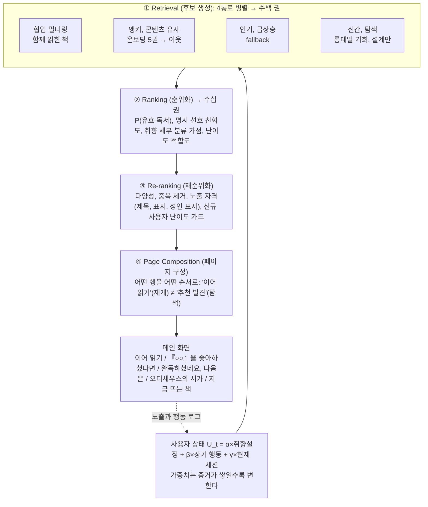
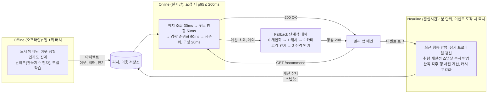
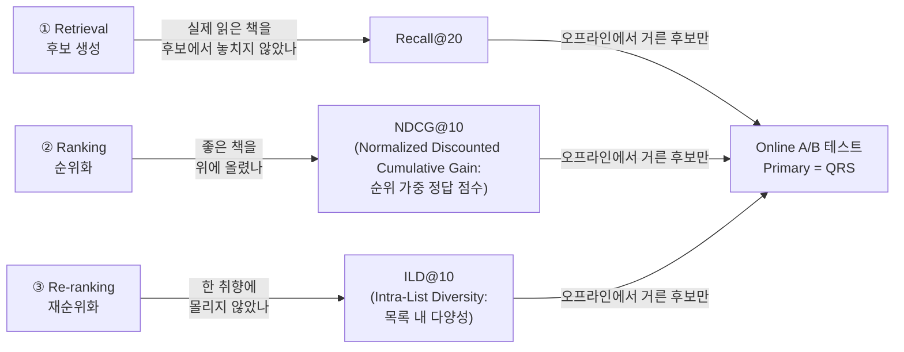

# 밀리의서재 메인 영역 추천 시스템 설계

---

# 1. 추천 목표와 활용 데이터

데모: https://millie-rec-production.up.railway.app/#/ (쇼케이스 화면에서 바로 눌러볼 수 있다, 가동 감시 https://stats.uptimerobot.com/20M6QwPo7z)

## 1-1. 한 줄 요약 [①]
> 취향 설정으로 시작하되 실제 독서 행동이 쌓일수록 그 비중을 높여, **"클릭할 책"이 아니라 "실제로 읽기 시작할 책"** 을 메인에 보여준다.

과제의 네 축에 이 문서는 다음 한 문장씩으로 답한다.

| 축 | 한 문장 | 장 |
|---|---|---|
| ① 추천 목표 | 클릭이 아니라 QRS(Qualified Reading Start: 유효 독서 시작)를 올린다 | 1 |
| ② 활용 데이터 | 취향 설정 7단계의 신호 5종 + 독서 행동 로그 + 도서 메타(완독지수)를 서로 다른 신호로 쓴다 | 1, 2 |
| ③ 추천 구조 | 후보 생성 → 순위화 → 재순위화 → 페이지 구성 4단계를 Offline, Nearline, Online 3계층 위에서 돌린다 | 2, 3 |
| ④ 성능 평가 | Offline 3지표를 구조 3단계에 1:1로 붙이고 최종 판정은 A/B로 한다 | 4 |

## 1-2. 문제 [①]
메인에서 읽을 책을 못 찾으면 탐색을 포기하고, 반복되면 구독을 해지한다. 밀리 앱은 가입 시 7단계 취향 설정을 받지만, 이 신호가 메인에 **어떻게, 얼마나 오래** 반영되는지는 정의되어 있지 않다. Netflix는 시청의 약 80%가 추천에서 나오며 개인화의 구독 유지 효과가 연 $1B에 이른다고 보고한다. 도서 구독도 같다. **다음에 읽을 책이 계속 나오는 경험이 곧 해지 방지**다.

## 1-3. 추천 목표, 기대 효과, 측정 지표 [①]

| 관점 | 목표 | 측정 지표 |
|---|---|---|
| 비즈니스 | 추천 경유 독서 경험 → 구독 유지 | 30일 리텐션, 월 갱신율 |
| 사용자 | 열어보기 전에 흥미 있는 책을 찾는다, **어려워서 덮는 경험을 막는다** | 독서 시작까지 탐색 시간, 초반 이탈률 |
| 기술 (North Star: 북극성 지표) | **QRS**: 추천 노출 후 T분/T페이지 이상 읽기 시작한 세션 비율. T는 임의 확정하지 않고 실로그 분포로 결정 | 메인 경유 QRS / 메인 노출 활성 세션 |

**CTR(Click-Through Rate: 클릭률)은 진단 지표이지 목적이 아니다.** YouTube는 클릭 최적화가 낚시성 콘텐츠를 보상하는 문제로 목표를 시청 시간 → 설문 기반 만족도로 바꿨다. 도서에서 그 실패는 **난이도 미스매치**라는 고유 사례로 나타난다. 주제가 맞아 클릭했지만 너무 어려워 초반에 덮으면 독서 흥미 자체가 꺾인다. 난이도는 분량이나 카테고리와 별개다.

**기대 효과**
1. 신규 사용자가 첫 화면부터 *이유가 보이는* 추천("『○○』을 좋아하셨다면")을 받아 첫 독서 시작까지 시간 단축
2. 취향 재설정이나 완독 직후처럼 의도가 분명한 순간에 즉시 반응하는 메인
3. 난이도 미스매치 이탈 감소 → QRS 개선, **신규 사용자 첫 완독 도달률** 개선 → 구독 유지

## 1-4. 활용 데이터: 취향 설정 7단계는 전부 다른 종류의 신호다 (그림 1) [②]

| 신호 | 어떻게 쓰나 | 쓰지 않는 방법 (흔한 실수) |
|---|---|---|
| 독서 시간대 | 맥락 신호로 수집하고 전달(응답의 `context`). 포맷×맥락 교차항은 학습형 랭커 몫 | ✗ "자기 전 = 에세이" 같은 장르 규칙 |
| 책 5권 선택 | 유사 도서 검색의 출발점 + 앵커 | ✗ **미선택 책을 부정 신호로 사용**. 노출 위치 때문에 못 본 것일 뿐 |
| 페르소나 | "오디세우스의 서가" 같은 추천 이유 표현 | ✗ 모델 입력 (원본 신호가 아래에 있음) |

취향 설정 화면은 추천 데이터를 만드는 정책이면서 노출 편향을 낳는 자리다. **미선택 책은 negative가 아니다**. 노출 위치 때문에 못 본 것일 뿐이다. 따라서 어떤 후보를 몇 번째에 보여줬고 무엇을 골랐는지까지 로깅한다. 모든 추천 노출에 `추천 ID, 모델 버전, 행 ID, 위치`를 남겨야 **A/B 귀속과 노출 편향 보정**의 전제가 선다.

---

# 2. 추천 구조: 전체 플로우

## 2-1. 4단계 파이프라인 (그림 2) [③]

| 단계 | 하는 일 | 왜 분리하나 | 담당 지표 |
|---|---|---|---|
| ① 후보 생성 | 수십만 권 → 수백 권. 통로별로 다른 강점(행동, 콘텐츠, 인기, 신선도) | 정밀한 순위화는 비싸므로 먼저 좁힌다. 신규 사용자는 앵커와 콘텐츠 통로가, skip 사용자는 인기 통로가 담당 | Recall@K |
| ② 순위화 | 후보를 유효 독서 확률로 정렬 | 목표 지표(QRS)를 직접 최적화하는 유일한 단계 | NDCG@K |
| ③ 재순위화 | 다양성, 중복, 노출 자격, 가드 | 정확도만 좇으면 같은 장르가 반복된다. 규칙은 모델보다 안전하게 신규 사용자를 보호 | ILD@K |
| ④ 페이지 구성 | 행 선택, 순서, 행 간 중복 제거 | 메인은 Top-K 리스트가 아니라 **페이지**다(Netflix 홈 원칙). 재개와 탐색은 다른 목적. 데모의 탐색은 ①의 통로가 아니라 이 단계의 "새로운 발견" 행이다 | 행 단위 QRS |

YouTube 추천 논문의 표준 구조를 따라 **후보 생성과 순위화를 분리**했고 Netflix 홈페이지 설계 원칙에 맞춰 **페이지 구성을 별도 단계로** 두었다. 규모는 실측한 밀리 공개 카탈로그(약 9천 권)에 맞춰 Item-KNN(Item-based k-Nearest Neighbors: 함께 읽힌 책 기반 유사도) + 콘텐츠 유사도로 충분하다고 판단했다.

## 2-2. 사용자 상태: 시간에 따라 변하는 가중치 [②③]

$$U_t = \alpha_t\,U_{\text{취향설정}} + \beta_t\,U_{\text{장기행동}} + \gamma_t\,U_{\text{세션}}, \quad \alpha+\beta+\gamma = 1$$

| 사용자 상태 | α 취향설정 | β 장기 행동 | γ 세션 | 메인이 보여주는 것 |
|---|---|---|---|---|
| 가입 직후 (독서 0회) | **높음** | 0 | 0 | 온보딩 5권의 이웃 + 카테고리 인기 |
| 독서 축적 (n회) | 감쇠 $\alpha_n = \alpha_0 e^{-n/\tau}$ | **상승** | 낮음 | 실제 읽은 책 기반 추천이 초기 설정을 대체 |
| 취향 재설정 직후 | **다시 높음** | 유지 | 0 | 새 선호 즉시 반영, **기존 기록은 삭제 안 함** |
| 완독 직후 / 집중 탐색 | 유지 | 유지 | **일시 상승** | "완독하셨네요, 다음은" / 지금 찾는 주제 |

가중치는 **그 사용자에 대해 쌓인 증거의 양과 최근성의 함수**로 정해진다. 감쇠 속도 τ는 단정하지 않고 오프라인 재현 평가와 A/B로 정한다. **취향 재설정 ≠ 프로필 초기화**. 재설정마다 스냅샷을 새로 만들고 기존 기록은 유지하며 Nearline으로 수 분 내 반영한다("방금 알려줬는데 반영 안 됨"이 최악의 UX).

**구현 결정.** α/β/γ는 **사용자 벡터의 세 성분**(취향 설정, 장기 행동, 세션)에 붙는 가중치이고 채널(협업, 콘텐츠, 인기) 혼합비는 이와 별개의 상수다. 신규 사용자는 장기와 세션 성분이 비어 재정규화로 α=1이 되고 이력 n권이 쌓이면 α_n = max(0.2, 0.6×e^{−n/20})로 감쇠하며 나머지를 β:γ = 3:1로 나눈다. 초기값과 하한은 규칙이고 τ는 A/B로 정한다. 응답의 `user_state_weights`는 이 같은 함수에서 나오므로 화면에 보이는 혼합비와 실제 순위화의 혼합비가 일치한다.

**구현.** 파이프라인 4단계가 코드 폴더와 1:1이고 경계는 아키텍처 테스트가 강제한다.

---

# 3. 기술 스택과 시스템 아키텍처

## 3-1. 운영 3계층 (그림 3) [③]

| 계층 | 주기 | 왜 여기에 두나 |
|---|---|---|
| **Offline** | 일 1회 | 무겁고 하루 단위로만 바뀐다 |
| **Nearline** | 분 단위, 이벤트 즉시 | 사용자 의도가 바뀐 순간에 반응해야 하지만 요청 경로 안에서 계산하면 지연 예산을 깬다 |
| **Online** | 요청 시 | 200ms 안에 끝나는 것만 |

**요청마다 무거운 계산을 다시 하지 않는다**. 지연 예산을 기준으로 계층을 나눴고 추천 API p95 200ms(과제용 제안 SLO(Service Level Objective: 서비스 수준 목표); 내부 값 비공개)를 단계별로 쪼개 예산을 넘는 연산은 전부 Offline/Nearline으로 내렸다. 예산을 넘거나 예외가 나면 fallback cascade(단계적 대체) 0→3으로 내려간다.

**추천 API 장애가 메인 장애가 되어선 안 된다.** 파이프라인이 예외를 던져도 200 + 인기 행을 반환하는 것이 테스트로 존재한다(`tests/serving/test_smoke.py`의 fallback 200 테스트).

## 3-2. 기술 스택과 선택 이유 [③]

| 목적 | MVP (구현) | 실서비스 확장 | 이 선택의 이유 |
|---|---|---|---|
| 협업 필터링 | **Item-KNN** (scipy sparse cosine) | Two-Tower(투 타워: 사용자/아이템 임베딩 분리 학습) + ANN(Approximate Nearest Neighbor: 근사 최근접 탐색) 인덱스 | 실측 약 9천 권(공개 도서 페이지 9,447권, `results/millie_coverage.csv`) 규모엔 KNN으로 충분. **같은 이웃 행렬이 "『○○』을 좋아하셨다면" 행의 근거** |
| 콘텐츠 유사 | TF-IDF(Term Frequency–Inverse Document Frequency: 단어 빈도 기반 텍스트 벡터) + cosine | 텍스트 임베딩 모델 | 신규 도서, 신규 사용자 cold-start(콜드 스타트: 데이터 없는 초기 상태) 통로 |
| 순위화 | 가중합(α β γ) | 다중 목표 학습형 랭커(유효 독서, 서재 담기, 완독 동시 예측) | 첫 모델은 단순하게: 파이프라인, 지표, 인프라를 먼저 검증한다(Google ML 설계 원칙) |
| 재순위화 | MMR(Maximal Marginal Relevance: 관련성과 다양성 균형) + 규칙 가드 | 학습형 re-ranker | 모델보다 규칙이 안전 |
| 서빙 | FastAPI + pydantic 스키마 | Kubernetes | 응답 형태를 코드로 고정해 프론트/서버를 병렬 개발 |
| 저장 | SQLite(WAL) | Feature Store + Redis 캐시 | 스냅샷, 이벤트, 추천 로그 영구 저장 |
| 배포, 관측 | Docker 1컨테이너, Sentry(예외), 가동 모니터(5분 간격 헬스체크) | Prometheus → Grafana, 오토스케일링 | 이미지, 헬스체크, 재배포 경계가 동일. 지표 수집기는 설계만 |

**의도적으로 넣지 않은 것.** LLM(Large Language Model: 대규모 언어 모델)은 넣지 않았다. 추천이 이 문제의 본질이고 LLM은 도서 소개 임베딩 같은 오프라인 표현 생성에만 쓸 여지가 있다. Two-Tower는 넣지 않았다: 약 9천 권 규모에서 Item-KNN 대비 이득이 작고 같은 이웃 행렬이 추천 이유(『○○』을 좋아하셨다면)까지 설명하는 장점을 잃는다. ALS(Alternating Least Squares: 행렬 분해 협업 필터링)도 빌드 리스크 대비 Item-KNN과 설명력 차이가 작아 뺐다.

## 3-3. 실서비스 ↔ 데모 대응 [③]
| 실서비스 | 데모 축소판 | 보존되는 의미 |
|---|---|---|
| Kafka 이벤트 스트림 | SQLite `events` 테이블 + 소비 루프 | 생산자/소비자 분리, 순서, 멱등성 동일 |
| 스트리밍 Nearline | 단일 프로세스 비동기 루프 | "요청 경로 밖에서 상태를 갱신"이라는 경계가 코드에 존재 |
| Redis 캐시, Feature Store | 프로세스 내 dict + SQLite | fallback 1단계와 "재계산 안 함"의 의미 동일 |

각주: 데모 카탈로그는 밀리 공개 도서 페이지 9,447권(수치, 메타, 표지 URL만 저장, 리뷰 텍스트 미저장)이고 완독지수 커버리지는 82.5%다(`results/millie_coverage.csv`). 앵커 이웃은 제목/소개 TF-IDF cosine이고 동일 카테고리 비율은 0.356이다(`results/millie_edges_gate.json`).
각주: 같은 컨테이너 이미지가 로컬 docker와 Railway에서 동일하게 뜨고(`/health`의 `model_version` 일치), 재배포 중에도 SQLite 볼륨은 유지된다.

---

# 4. 성능 평가 방법

## 4-1. Offline: 지표 3개가 구조 3단계와 1:1 (그림 4) [④]

지표가 단계와 1:1이므로 **어느 단계가 문제인지** 바로 읽을 수 있다. 다양성(ILD)은 수십만 권 카탈로그를 활용하기 위한 제품 지표다.

**실측 (`results/latest_states.csv`, Goodbooks-10k, holdout, seed 42)**

| 모델 | 사용자 상태 | Recall@20 | NDCG@10 | ILD@10 | n |
|---|---|---:|---:|---:|---:|
| pop (전역 인기, 기준선) | 온보딩 직후 (n=0) | 0.063 | 0.054 | 0.764 | 2,000 |
| pop (전역 인기, 기준선) | 이력 축적 (n≥20) | 0.080 | 0.087 | 0.746 | 1,990 |
| cf (Item-KNN) | 온보딩 직후 (n=0) | 0.117 | 0.107 | 0.643 | 2,000 |
| cf (Item-KNN) | 이력 축적 (n≥20) | 0.207 | 0.237 | 0.738 | 1,990 |
| hybrid (+취향 설정, 콘텐츠) | 온보딩 직후 (n=0) | 0.118 | 0.110 | 0.606 | 2,000 |
| hybrid (+취향 설정, 콘텐츠) | 이력 축적 (n≥20) | 0.204 | 0.240 | 0.717 | 1,990 |
| hybrid_div (+다양성, 난이도 가드) | 온보딩 직후 (n=0) | 0.116 | 0.107 | 0.684 | 2,000 |
| hybrid_div (+다양성, 난이도 가드) | 이력 축적 (n≥20) | 0.205 | 0.238 | 0.780 | 1,990 |

(그림 5, 비교 막대: `report/figures/eval_bar.png`, Notion 삽입, 폭 1/2)
그림 5. 온보딩 직후(n=0) 상태의 4 variant × Recall@20, NDCG@10, ILD@10(`results/latest.csv`, Goodbooks-10k, holdout, n=2,000). 위 표의 n=0 4행과 같은 숫자다.

§2-2 "가중치가 변해야 한다"를 숫자로 보이려고 같은 모델을 온보딩 직후(n=0)와 이력 축적(n≥20)에서 따로 측정했다. n≥20에서 NDCG@10은 pop 0.087 대 hybrid 0.240으로 격차가 0.153이다. 이력 성분 β가 순위화에 들어온다는 주장을 이 숫자가 뒷받침하고 같은 상태의 cf 0.237과 hybrid의 차이는 0.003으로 작다. pop 기준선의 두 값 차이는 추천 제외 범위(n=0은 5권만, n≥20은 이력 전체)에서 온 바닥선이라 모델 성능과 무관하다.

MMR 재순위화(λ=0.7)로 n=0에서 NDCG@10은 0.110→0.107로 2.7% 내렸지만 ILD@10은 0.606→0.684로 올랐고, 통과 기준(ILD@10 상승 ∧ NDCG@10 하락 20% 이내)을 만족해 상수를 조정 없이 고정했다. 데모 카탈로그(밀리)에는 사용자 로그가 없어 협업 채널 자리에 콘텐츠 유사도 이웃이 들어가고 그 숫자는 이 표에 넣지 않는다.

각주: Goodbooks-10k(CC BY-SA 4.0), 유저와 아이템 ≥5 필터, 유저별 holdout 20%, 테스트 2,000명(seed 42), 정답 = 평점 ≥4, hybrid = 채널별 min-max 정규화 후 가중합(협업 0.5, 콘텐츠 0.3, 인기 0.2). 타임스탬프가 없어 무작위 분할을 썼으나 **실서비스 평가는 반드시 temporal split(시간순 분할)**로 미래 정보 누수를 막는다. 비교표는 공개 데이터, 데모 카탈로그/난이도/본인 5권은 밀리 표본이며 두 숫자를 한 표에 섞지 않는다.
각주: 고정 상수는 Item-KNN 이웃 50, 후보 풀 채널별 200, MMR 풀 50, λ=0.7, α₀/β₀/γ₀=0.6/0.3/0.1, τ=20, α 하한 0.2, 세부 분류 가점 0.06.

## 4-2. Online: A/B 테스트가 최종 판정 [④]

| 역할 | 지표 | 뜻 |
|---|---|---|
| **Primary** | QRS / 활성 사용자 | 이것만 보고 출시 여부를 결정 |
| Secondary | 추천 CTR, 서재 담기, 뷰어 열기, 독서 시간, 완독, **신규 사용자 첫 완독 도달률** | 인과 사슬 확인 |
| Discovery | 카탈로그 커버리지, 장르/작가 다양성 | 추천이 인기작에만 몰리는지 감시 |
| **Guardrail(안전장치)** | p95 지연, 오류율, fallback 비율, 중복 노출률, 구독 해지율 | 하나라도 악화되면 출시 보류 |

- 배정 단위는 **사용자 키**(기기 단위 배정의 폰과 태블릿 불일치 방지), 신규/기존 **층화**(취향 설정 효과는 신규에서 봐야 함), MDE(Minimum Detectable Effect: 최소 검출 효과) 기반 표본 산정
- 판정 규칙: `CTR↑ 그러나 QRS↓ → 실패` / `CTR≈ QRS↑ → 성공` / `QRS↑ 지연 폭증 → 배포 보류`
- 취향 설정 플로우 자체(질문 수, 5권 개수)도 실험 대상

## 4-3. 실서비스 제약 → 설계 결정 [③④]

| 제약 | 그래서 이렇게 설계했다 | 증거 |
|---|---|---|
| **응답 지연** p95 200ms | 무거운 연산은 Offline/Nearline, Online은 조합 + 캐시. 초과, 예외 시 fallback 0→3 | fallback 200 테스트, 로컬 bench p95 **79.5ms**(variant 공통 전역 p95: 셀 혼합 bench, 사용자 50, warmup 50, 500요청, k 40, `results/latency.json`) |
| **개인정보** | 추천 모델은 직접 식별자가 필요 없다 → 가명 키로 신원 DB와 분리, 최소 수집. 맞춤 추천 동의 철회 시 개인 피처 차단 → 비개인화 fallback. 취향 재설정과 추천 제외 = 사용자 통제권 | `GET/DELETE /api/users/{key}/*`, 철회 후 level 3(테스트 `test_delete_personalization_then_level3_until_reconsent`) |
| **데이터 품질** | 이벤트 스키마 검증, 멱등 중복 제거, 노출 위치 로깅(편향 보정), 학습-서빙 동일 변환 코드, 노출 자격 게이트(제목, 표지, 성인 표지; 실서비스는 품절, 권역 제한), **미선택 책은 negative가 아니다** | 멱등 dedupe 테스트, 평가/서빙 공용 `StagedPipeline` |
| **운영 비용** | 임베딩과 이웃은 일 1회 배치, 서빙은 CPU, 컨테이너 1개 | 설계 |
| **모니터링** | 예외는 Sentry, 가동은 5분 간격 헬스체크, 추천 품질은 Offline 3지표 추이, drift, 신규/기존 분리로 본다 | Sentry(예외) 연결, 가동 감시 5분, 지표 수집기(Prometheus→Grafana)는 설계만 |

---

# 5. 도서 도메인 고유 설계, 데모, 로드맵

## 5-1. 데모: 눌러볼 수 있는 설계 [②③]

| 데모 | QR |
|---|---|
| https://millie-rec-production.up.railway.app/#/ (쇼케이스 화면에서 "신규 유저로 체험하기"로 시작한다) | (QR: `report/figures/p5_qr.png`, Notion 삽입, 폭 1/6) |

심사 기간 가동 감시(5분 간격 헬스체크): https://stats.uptimerobot.com/20M6QwPo7z

자기계발 독자가 취향 설정에서 5권을 고르면 메인 첫 행이 "『○○』을 좋아하셨다면" 앵커 행이 된다. 한 권을 완독하고 별점을 한 번 누르면 메인 최상단에 "완독하셨네요, 다음은" 행이 생기는데, 별점은 만족 라벨 수집이고 모델 입력으로 쓰는 것은 설계만이다. 취향을 SF로 재설정하면 기존 기록은 남고 앵커와 페르소나 행만 즉시 바뀐다.

완독 후 추천 보기: ① 메인 책 카드 → ② 책 상세 「바로 읽기」 → ③ 뷰어 「완독」 → ④ 별점 ★ 1탭(「나중에」도 가능) → ⑤ 메인 최상단 "『○○』을 완독하셨네요, 다음은" 행.

(그림 6, 데모 캡처 3×2: Notion 3 컬럼 × 2행, 각 폭 1/3. 파일은 `report/figures/p5_01_onboarding.png` ~ `p5_06_home_after.png`)

| ① 취향 설정: 5권 선택 (`p5_01_onboarding.png`) | ② 메인: "『○○』을 좋아하셨다면" 앵커 행, 경로 ① (`p5_02_home.png`) | ③ 책 상세: 「바로 읽기」, 경로 ② (`p5_03_detail.png`) |
|---|---|---|
| ④ 뷰어: 「완독」 후 별점 1탭, 경로 ③~④ (`p5_04_reader_done.png`) | ⑤ 취향 재설정: SF로 (`p5_05_refresh.png`) | ⑥ 메인 변화: "완독하셨네요, 다음은" 행, 새 앵커, 경로 ⑤ (`p5_06_home_after.png`) |

그림 6. 배포본에서 그대로 찍은 화면 6장(폰 프레임). 캡션 ①~⑥은 위 시나리오의 순서와 같고, ②③④⑥에 적은 경로 번호는 바로 위 클릭 경로의 단계다.

## 5-2. ★ 도서 도메인 고유 설계 3가지 [①②③]

> ★ **앵커: "아는 책"으로 판단하게 한다.** 모르는 책은 설명을 읽어도 감이 안 오지만, 온보딩 5권은 사용자가 이미 아는 책이다. 그래서 첫날부터 "『○○』을 좋아하셨다면" 행을 만들고, 취향을 재설정하면 새 5권이 즉시 앵커가 된다(캡처 ②와 ⑥, §5-3 표). 향후 앵커는 완독한 책 → 서재에 담은 책 → 취향이 비슷한 다독가의 고평점 책으로 넓히고, 어느 앵커가 효과적인지는 bandit(밴딧: 실험하며 학습)으로 고른다. 행 단위 QRS를 분리 집계하기 위해 노출 로그에 행 ID를 남긴다.

> ★ **난이도: 밀리 완독지수에서 파생한다.** 밀리가 책마다 보여주는 완독지수(완독 확률, 예상 시간, 분야 평균)를 추천 피처로 되먹이므로 새 파이프라인이 필요 없다. 완독 확률을 그대로 쓰면 길이와 장르에 교란되므로 분야와 길이를 걷어낸 잔차로 난이도를 정의하고 사용자 수준과의 차이(gap)를 순위화 피처로 쓴다. IRT(Item Response Theory: 문항반응이론)가 말하듯 난이도와 능력의 차이가 결과를 좌우한다. 완독 확률의 분야 평균은 오디오북 40.3%에서 어린이 79.0%까지 벌어지지만 잔차 난이도의 분야 평균은 0.488~0.505에 모인다(8개 분야, 7,796권, `results/millie_difficulty.json`). 완독 3권 미만 사용자에게는 잔차 하위 책을 상단에 올리지 않는 가드를 걸고, 난이도는 UI에 숫자로 노출하지 않는다.

| 층 | 피처 | 역할 |
|---|---|---|
| 원시 | 완독 확률, 예상 시간, 분야 평균(밀리 완독지수) | 이미 보여주는 값을 그대로 입력, 새 추정 없음 |
| 분야와 길이 잔차 | resid_z = 분야와 예상 시간 분위 안에서의 완독 확률 잔차 | "길이 대비 못 읽고 덮는 정도", 길이 교란 제거 |
| 사용자 수준 gap | gap = 책 난이도 − 사용자 수준(부호 유지), gap⁺, 완독 수 × gap | 순위화 피처 3항, 결측과 수준 미확정은 가중 0 |
| 신규 가드 | 완독 <3권 ∧ 잔차 하위 → 첫 화면 상단 제외 | 증거 없는 사용자엔 모델보다 규칙이 안전, 완독지수가 있는 책(82.5%)만 모집단 |

> ★ **시간 가변 가중치: 증거가 쌓일수록 취향 설정의 비중이 내려간다.** 사용자 상태는 취향 설정, 장기 행동, 세션 세 성분의 가중합이고, 가중치는 그 사용자에게 쌓인 증거의 양과 최근성의 함수다(수식과 상태표는 §2-2). 가입 직후엔 α=1로 온보딩 5권이 전부를 결정하고, 이력 n권이 쌓이면 α_n = max(0.2, 0.6×e^{−n/20})로 내려가며 나머지를 장기 행동과 세션이 나눈다. n≥20에서 NDCG@10이 pop 0.087 대 hybrid 0.240으로 격차 0.153이 난 것(§4-1 표)에서 이 설계가 숫자로 드러나고 같은 상태의 cf 0.237과의 차이는 작다.

## 5-3. 본인 5권 앵커 사례 [②]

| 시드(본인이 읽은 5권) | 앵커 행 대표 이웃 1 | 앵커 행 대표 이웃 2 |
|---|---|---|
| 『싯다르타』 | 변신 이야기 1 | 햄릿 |
| 『데미안』 | 싯다르타(최유경 옮김) | 변신 이야기 1 |
| 『위버멘쉬』 | 혼자일 수 없다면 나아갈 수 없다 | 차라투스트라는 이렇게 말했다 |
| 『쇼펜하우어 인생수업: 한 번뿐인 삶 이렇게 살아라』 | 쇼펜하우어의 인생 수업 | 마흔에 읽는 쇼펜하우어 |
| 『빅터 프랭클의 죽음의 수용소에서』 | 청소년을 위한 빅터 프랭클의 죽음의 수용소에서 | 그럼에도 삶에 ‘예’라고 답할 때 |

서버 응답의 앵커 행 상위 5권에서 시드 자신과 같은 작품의 다른 권과 판본을 뺀 대표 이웃 2권이다(『위버멘쉬』 행은 주제가 무관한 1위 1권도 제외; `report/demo_5books.md`, 밀리 카탈로그 9,447권). 데모 카탈로그의 이웃은 콘텐츠 유사도(제목/소개 TF-IDF)이고 실서비스에서는 Item-KNN 이웃이 이 자리에 들어간다.

## 5-4. 로드맵과 기억할 5가지 [③④]

**로드맵(설계만).** Two-Tower + ANN, 다중 목표 학습 랭커, Kafka 기반 Nearline, 텍스트 가독성 난이도, 다독가 리뷰 통로, Interleaving(인터리빙: 두 랭커 결과를 한 목록에 섞어 비교), 적응형 취향 질의(다음 질문을 불확실성 기준으로 선택).

**기억할 5가지.** ① 취향 설정 = 시작점이자 언제든 갱신되는 상태 ② 설문 7단계를 전부 다른 신호로 ③ 클릭이 목표가 아니다 ④ Top-K에서 끝내지 않고 페이지 구성까지가 메인 추천 ⑤ 정확도와 실서비스 제약을 같은 수준에서. 메시지는 "Netflix/YouTube 모델을 만들었다"가 아니라 **"공식 설계 원칙을 밀리의 UI, 데이터, 규모에 맞게 번역했다"**.
