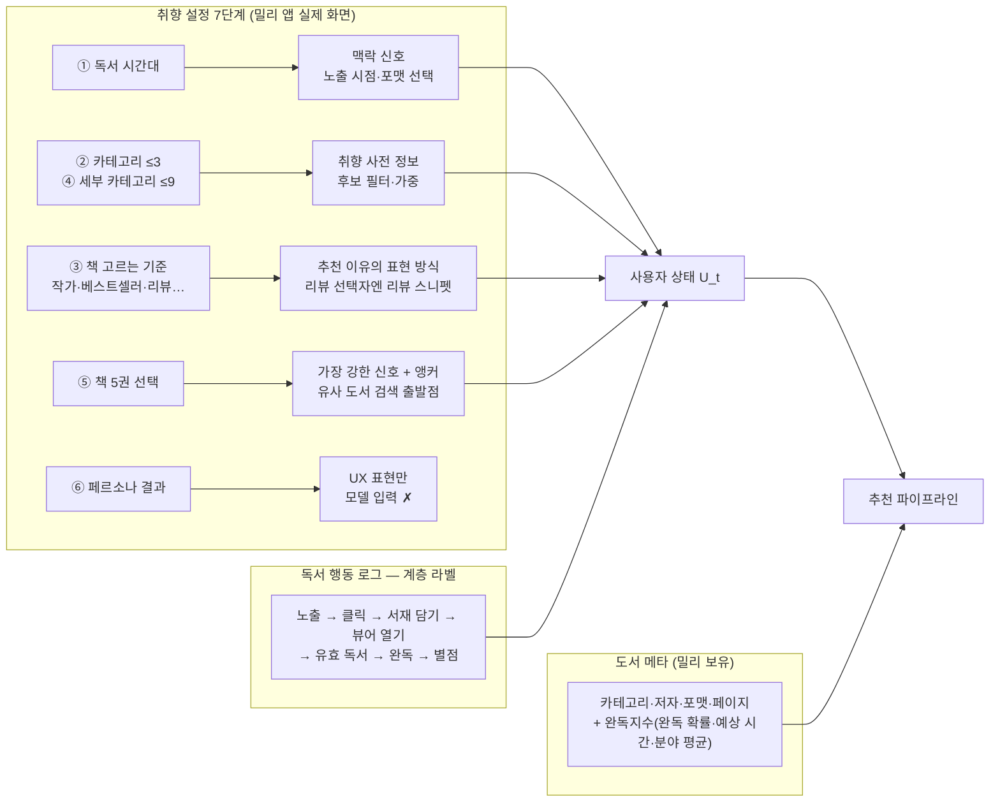
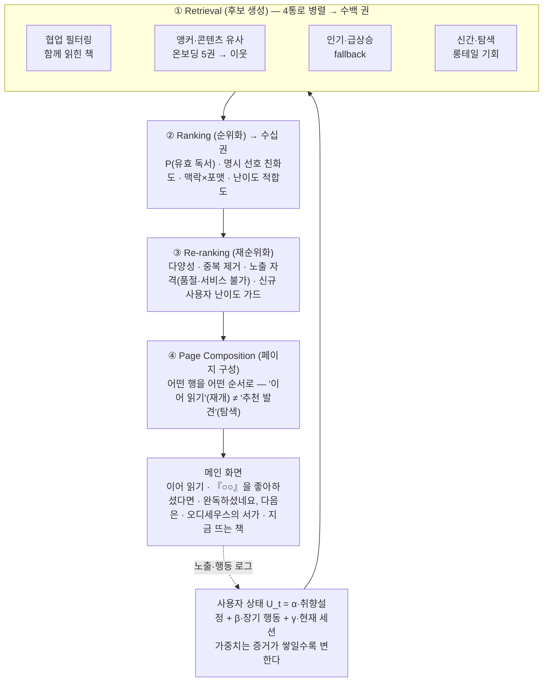
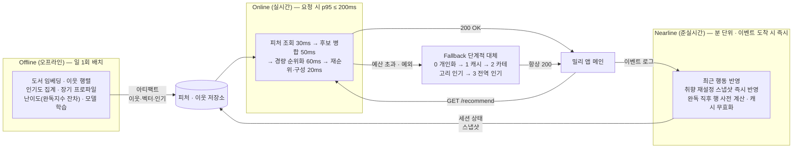
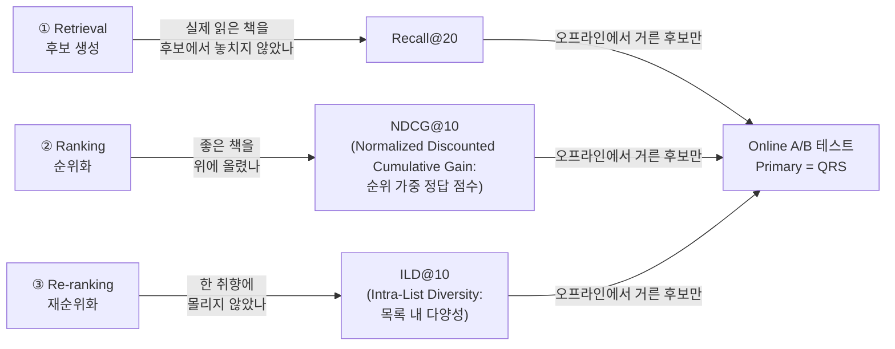

# 밀리의서재 메인 영역 추천 시스템 설계

> 조판: Notion → PDF 내보내기 5장. 숫자는 `results/`에서만. `[Phase N]` = 채울 자리. 영어 용어는 첫 등장에 `용어(풀네임: 설명)`. 출처 각주 없음.
> 분량 배분(Notion 기준): 1장 목표·데이터 / 2장 구조·플로우 / 3장 스택·아키텍처 / 4장 평가 / 5장 고유 설계·데모·제약 요약

---

# 1. 추천 목표와 활용 데이터

## 1-1. 한 줄 요약
> 취향 설정으로 시작하되 실제 독서 행동이 쌓일수록 그 비중을 높여, **"클릭할 책"이 아니라 "실제로 읽기 시작할 책"** 을 메인에 보여준다.

## 1-2. 문제
메인에서 읽을 책을 못 찾으면 탐색을 포기하고, 반복되면 구독을 해지한다. 밀리 앱은 가입 시 7단계 취향 설정을 받지만, 이 신호가 메인에 **어떻게·얼마나 오래** 반영되는지는 정의되어 있지 않다. Netflix는 시청의 약 80%가 추천에서 나오며 개인화의 구독 유지 효과가 연 $1B에 이른다고 보고한다. 도서 구독도 같다. **다음에 읽을 책이 계속 나오는 경험이 곧 해지 방지**다.

## 1-3. 추천 목표 · 기대 효과 · 측정 지표

| 관점 | 목표 | 측정 지표 |
|---|---|---|
| 비즈니스 | 추천 경유 독서 경험 → 구독 유지 | 30일 리텐션, 월 갱신율 |
| 사용자 | 열어보기 전에 흥미 있는 책을 찾는다 · **어려워서 덮는 경험을 막는다** | 독서 시작까지 탐색 시간, 초반 이탈률 |
| 기술 (North Star: 북극성 지표) | **QRS(Qualified Reading Start: 유효 독서 시작)** — 추천 노출 후 T분/T페이지 이상 읽기 시작한 세션 비율. T는 임의 확정하지 않고 실로그 분포로 결정 | 메인 경유 QRS / 메인 노출 활성 세션 |

**CTR(Click-Through Rate: 클릭률)은 진단 지표이지 목적이 아니다.** YouTube는 클릭 최적화가 낚시성 콘텐츠를 보상하는 문제로 목표를 시청 시간 → 설문 기반 만족도로 바꿨다. 도서에서 그 실패의 고유 사례가 **난이도 미스매치**다. 주제가 맞아 클릭했지만 너무 어려워 초반에 덮으면 독서 흥미 자체가 꺾인다. 난이도는 분량이나 카테고리와 별개다.

**기대 효과**
1. 신규 사용자가 첫 화면부터 *이유가 보이는* 추천("『○○』을 좋아하셨다면")을 받아 첫 독서 시작까지 시간 단축
2. 취향 재설정·완독 직후처럼 의도가 분명한 순간에 즉시 반응하는 메인
3. 난이도 미스매치 이탈 감소 → QRS 개선, **신규 사용자 첫 완독 도달률** 개선 → 구독 유지

## 1-4. 활용 데이터 — 취향 설정 7단계는 전부 다른 종류의 신호다

| 신호 | 어떻게 쓰나 | 쓰지 않는 방법 (흔한 실수) |
|---|---|---|
| 독서 시간대 | 노출 시점·포맷(오디오북 등)의 맥락 피처 | ✗ "자기 전 = 에세이" 같은 장르 규칙 |
| 책 5권 선택 | 유사 도서 검색의 출발점 + 앵커 | ✗ **미선택 책을 부정 신호로 사용** — 노출 위치 때문에 못 본 것일 뿐 |
| 페르소나 | "오디세우스의 서가" 같은 추천 이유 표현 | ✗ 모델 입력 (원본 신호가 아래에 있음) |

취향 설정 화면 자체가 추천 데이터를 생성하는 정책이고 동시에 노출 편향의 원인이다. 따라서 어떤 후보를 몇 번째에 보여줬고 무엇을 골랐는지까지 로깅한다. 모든 추천 노출에 `추천 ID · 모델 버전 · 행 ID · 위치`를 남겨야 **A/B 귀속과 노출 편향 보정**의 전제가 선다.

---

# 2. 추천 구조 — 전체 플로우

## 2-1. 4단계 파이프라인 (그림 1)

| 단계 | 하는 일 | 왜 분리하나 | 담당 지표 |
|---|---|---|---|
| ① 후보 생성 | 수십만 권 → 수백 권. 통로별로 다른 강점(행동·콘텐츠·인기·신선도) | 정밀한 순위화는 비싸므로 먼저 좁힌다. 신규 사용자는 앵커·콘텐츠 통로가, skip 사용자는 인기 통로가 담당 | Recall@K |
| ② 순위화 | 후보를 유효 독서 확률로 정렬 | 목표 지표(QRS)를 직접 최적화하는 유일한 단계 | NDCG@K |
| ③ 재순위화 | 다양성·중복·노출 자격·가드 | 정확도만 좇으면 같은 장르가 반복된다. 규칙은 모델보다 안전하게 신규 사용자를 보호 | ILD@K |
| ④ 페이지 구성 | 행 선택·순서·행 간 중복 제거 | 메인은 Top-K 리스트가 아니라 **페이지**다(Netflix 홈 원칙). 재개와 탐색은 다른 목적 | 행 단위 QRS |

**후보 생성과 순위화를 분리**하는 것은 YouTube 추천 논문의 표준 구조이고, **페이지 구성을 별도 단계로** 두는 것은 Netflix 홈페이지 설계 원칙이다. 규모는 밀리(수십만 권)에 맞춰 Item-KNN(Item-based k-Nearest Neighbors: 함께 읽힌 책 기반 유사도) + 콘텐츠 유사도로 충분하다고 판단했다.

## 2-2. 사용자 상태 — 시간에 따라 변하는 가중치

$$U_t = \alpha_t\,U_{\text{취향설정}} + \beta_t\,U_{\text{장기행동}} + \gamma_t\,U_{\text{세션}}, \quad \alpha+\beta+\gamma = 1$$

| 사용자 상태 | α 취향설정 | β 장기 행동 | γ 세션 | 메인이 보여주는 것 |
|---|---|---|---|---|
| 가입 직후 (독서 0회) | **높음** | 0 | 0 | 온보딩 5권의 이웃 + 카테고리 인기 |
| 독서 축적 (n회) | 감쇠 $\alpha_n = \alpha_0 e^{-n/\tau}$ | **상승** | 낮음 | 실제 읽은 책 기반 추천이 초기 설정을 대체 |
| 취향 재설정 직후 | **다시 높음** | 유지 | 0 | 새 선호 즉시 반영, **기존 기록은 삭제 안 함** |
| 완독 직후 / 집중 탐색 | 유지 | 유지 | **일시 상승** | "완독하셨네요, 다음은" / 지금 찾는 주제 |

가중치는 **그 사용자에 대해 쌓인 증거의 양과 최근성의 함수**로 정해진다. 감쇠 속도 τ는 단정하지 않고 오프라인 재현 평가와 A/B로 정한다. **취향 재설정 ≠ 프로필 초기화**. 재설정마다 스냅샷을 새로 만들고 기존 기록은 유지하며 Nearline으로 수 분 내 반영한다("방금 알려줬는데 반영 안 됨"이 최악의 UX).

**구현 결정.** α/β/γ는 **사용자 벡터의 세 성분**(취향 설정·장기 행동·세션)에 붙는 가중치이고 채널(협업·콘텐츠·인기) 혼합비는 이와 별개의 상수다. 신규 사용자는 장기·세션 성분이 비어 재정규화로 α=1이 되고 이력 n권이 쌓이면 α_n = max(0.2, 0.6·e^{−n/20})로 감쇠하며 나머지를 β:γ = 3:1로 나눈다. 초기값·하한은 규칙이고 τ는 A/B로 정한다. 응답의 `user_state_weights`는 이 같은 함수에서 나오므로 화면에 보이는 혼합비와 실제 순위화의 혼합비가 일치한다.

**구현 현황.** 파이프라인 단계 = 코드 폴더(`data/ retrieval/ ranking/ reranking/ evaluation/ serving/`). 각 폴더는 계약 파일 `contracts.py`만 import하며 아키텍처 테스트가 이를 강제한다. 인기·콘텐츠 후보 생성·평가 하네스·서빙 골격 완료. 협업 필터링·하이브리드 변형·다양성 재순위화·난이도 가드 완료(Phase 4).

---

# 3. 기술 스택과 시스템 아키텍처

## 3-1. 운영 3계층 — 요청마다 무거운 계산을 다시 하지 않는다 (그림 2)

| 계층 | 주기 | 담당 | 왜 여기에 두나 |
|---|---|---|---|
| **Offline** | 일 1회 | 임베딩·이웃 행렬·인기도·모델 학습·난이도 산출 | 무겁고 하루 단위로만 바뀐다 |
| **Nearline** | 분 단위·이벤트 즉시 | 최근 행동, 취향 재설정, 완독 직후 행 | 사용자 의도가 바뀐 순간에 반응해야 하지만 요청 경로 안에서 계산하면 지연 예산을 깬다 |
| **Online** | 요청 시 | 사전 계산 결과 조합 + 경량 순위화 + 페이지 조립 | 200ms 안에 끝나는 것만 |

**계층 배치의 기준은 지연 예산이다.** 추천 API p95 200ms(과제용 제안 SLO(Service Level Objective: 서비스 수준 목표); 내부 값 비공개)를 단계별로 쪼갰고 예산을 넘는 연산은 전부 Offline·Nearline으로 내렸다. 예산을 넘거나 예외가 나면 fallback cascade(단계적 대체) 0→3으로 내려간다. **추천 API 장애가 메인 장애가 되어선 안 된다.**

**구현 현황.** 파이프라인이 예외를 던져도 `GET /api/recommend`는 500 대신 **200 + fallback 3단계 + 인기 행**을 반환한다(`tests/serving/test_smoke.py`). 모델·아티팩트 없이 `make serve`만으로 `/health`·데모·fallback 추천이 뜬다. 위 원칙이 테스트로 존재한다.

## 3-2. 기술 스택과 선택 이유

| 목적 | 5일 MVP (구현) | 실서비스 확장 | 이 선택의 이유 |
|---|---|---|---|
| 협업 필터링 | **Item-KNN** (scipy sparse cosine) | Two-Tower(투 타워: 사용자·아이템 임베딩 분리 학습) + ANN(Approximate Nearest Neighbor: 근사 최근접 탐색) 인덱스 | 수십만 권 규모엔 KNN으로 충분. **같은 이웃 행렬이 "『○○』을 좋아하셨다면" 행의 근거** — 한 모델이 추천과 설명 두 역할 |
| 콘텐츠 유사 | TF-IDF(Term Frequency–Inverse Document Frequency: 단어 빈도 기반 텍스트 벡터) + cosine | 텍스트 임베딩 모델 | 신규 도서·신규 사용자 cold-start(콜드 스타트: 데이터 없는 초기 상태) 통로. 임베딩은 오프라인 표현으로만 후보 |
| 순위화 | 가중합(α β γ) | 다중 목표 학습형 랭커(유효 독서·서재 담기·완독 동시 예측) | 첫 모델은 단순하게 — 파이프라인·지표·인프라를 먼저 검증한다(Google ML 설계 원칙) |
| 재순위화 | MMR(Maximal Marginal Relevance: 관련성과 다양성 균형) + 규칙 가드 | 학습형 re-ranker | 증거 없는 신규 사용자엔 모델보다 규칙이 안전 |
| 서빙 | FastAPI + pydantic 스키마 | Kubernetes | 응답 형태를 코드로 고정해 프론트·서버를 병렬 개발. `/docs` 자동 문서 |
| 저장 | SQLite(WAL) | Feature Store + Redis 캐시 | 스냅샷·이벤트·추천 로그 영구 저장. "요청마다 재계산하지 않는다"의 증명 |
| 데이터 처리 | pandas + parquet | Spark | 수백만 행이면 충분 |
| 배포·관측 | Docker 1컨테이너 · Sentry(예외) · 가동 모니터(5분 간격 헬스체크) | Prometheus → Grafana · 오토스케일링 | 이미지·헬스체크·재배포 경계가 동일. 지표 수집기는 설계만 — 데모에서는 관제 화면이 서버 로그를 직접 집계한다 |

**의도적으로 넣지 않은 것과 이유.** **LLM(Large Language Model)** — 이 문제의 본질은 추천이며, 도서 설명 임베딩 생성 같은 오프라인 표현 용도만 가능성이 있다. **Two-Tower** — 5일 내 동작 보장이 안 되고 규모상 불필요. **ALS(Alternating Least Squares: 행렬 분해 협업 필터링)** — 빌드 리스크 대비 Item-KNN과 설명력 차이가 작다. 안 쓴 이유를 밝히는 것이 쓰는 것보다 판단을 더 잘 보여준다.

## 3-3. 실서비스 ↔ 5일 데모 대응
| 실서비스 | 데모 축소판 | 보존되는 의미 |
|---|---|---|
| Kafka 이벤트 스트림 | SQLite `events` 테이블 + 소비 루프 | 생산자/소비자 분리·순서·멱등성 동일 |
| 스트리밍 Nearline | 단일 프로세스 비동기 루프 | "요청 경로 밖에서 상태를 갱신"이라는 경계가 코드에 존재 |
| Redis 캐시 · Feature Store | 프로세스 내 dict + SQLite | fallback 1단계·"재계산 안 함"의 의미 동일 |
| Kubernetes | 컨테이너 1개 | 이미지·헬스체크·재배포 동일 |

- (Day 1 실측, Phase 3 '밀리 카탈로그 빌드') 데모 카탈로그 = 밀리의서재 공개 도서 페이지 9,447권(2026-09-04~05 수집 + 09-05 배지 제목 896건 재수집, 최종 스냅샷 09-06; 비로그인 화면의 수치·메타·표지 URL만, 리뷰 텍스트 미저장, 책 소개는 TF-IDF 입력 전용·미노출). 커버리지 title 100%·표지 100.0%·완독지수 82.5%(`results/millie_coverage.csv`, 결측 완독지수 책은 `difficulty=None` 으로 가드 모집단에서 제외). 앵커 이웃은 제목·소개 문자 2~4gram TF-IDF cosine top-20(content_sim, 동일 카테고리 비율 0.356, `results/millie_edges_gate.json`), 다양성 벡터는 같은 TF-IDF 의 SVD 128이다. 협업 필터링(Item-KNN) 수치는 Goodbooks(Track A)에서만 측정하고 두 트랙의 숫자는 각 표에 따로 싣는다. 서버는 `artifacts/serving/books_kr.json` 이 있으면 카탈로그를 주입해 `/api/recommend` 가 밀리 책으로 응답한다. 이 스냅샷은 Day 3 freeze 대상이라 이후 재빌드하지 않는다.
- (Day 2·Day 4 실측, Phase 7 '배포') 같은 이미지가 로컬 docker 와 Railway 에서 똑같이 뜬다(`/health` 의 `model_version` 이 양쪽 모두 `hybrid_div_v1`). 코드 push 재배포는 정지→시작이라 5초 폴링에서 1표본이 실패했고(약 5~15초, 2026-09-06 실측 3회), 볼륨을 처음 붙이는 재배포만 30~40초 걸렸다. 그 사이에도 볼륨 `/data` 의 SQLite 는 유지되어 재시작 후 사용자·스냅샷 행이 그대로였다. 가동은 5분 간격 헬스체크로 감시한다.

---

# 4. 성능 평가 방법

## 4-1. Offline — 지표 3개가 구조 3단계와 1:1 (그림 3)

지표가 단계와 1:1이므로 **어느 단계가 문제인지** 바로 읽을 수 있다. 다양성(ILD)은 24만 권 카탈로그를 활용하기 위한 제품 지표다. Netflix도 참여도와 소비 다양성을 함께 평가한다.

**실측 (Phase 4 완료, `results/latest_states.csv` · Goodbooks-10k · holdout)**

| 모델 | 사용자 상태 | Recall@20 | NDCG@10 | ILD@10 | n |
|---|---|---:|---:|---:|---:|
| pop (전역 인기, 기준선) | 온보딩 직후 (n=0) | 0.063 | 0.054 | 0.764 | 2,000 |
| pop (전역 인기, 기준선) | 이력 축적 (n≥20) | 0.080 | 0.087 | 0.746 | 1,990 |
| cf (Item-KNN) | 온보딩 직후 (n=0) | 0.117 | 0.107 | 0.643 | 2,000 |
| cf (Item-KNN) | 이력 축적 (n≥20) | 0.207 | 0.237 | 0.738 | 1,990 |
| hybrid (+취향 설정·콘텍츠) | 온보딩 직후 (n=0) | 0.118 | 0.110 | 0.606 | 2,000 |
| hybrid (+취향 설정·콘텍츠) | 이력 축적 (n≥20) | 0.204 | 0.240 | 0.717 | 1,990 |
| hybrid_div (+다양성·난이도 가드) | 온보딩 직후 (n=0) | 0.116 | 0.107 | 0.684 | 2,000 |
| hybrid_div (+다양성·난이도 가드) | 이력 축적 (n≥20) | 0.205 | 0.238 | 0.780 | 1,990 |

같은 모델을 **온보딩 직후(n=0)와 이력 축적(n≥20) 두 상태에서 따로 측정**하는 이유는 §2-2 "가중치가 변해야 한다"를 증명하기 위해서다. pop 기준선의 두 값 차이는 추천 제외 범위(n=0은 5권만, n≥20은 이력 전체 제외)에서 온 바닥선이며 모델 성능과는 무관하다. **hybrid가 n≥20에서 pop 대비 격차를 벌려야 증거**가 된다. MMR 적용으로 NDCG@10은 0.110→0.107로 소폭 하락했지만 ILD@10은 0.606→0.684로 개선됐다. 동일 장르 반복을 줄이는 UX 목적상 허용 가능한 trade-off이며 최종 판단은 A/B로 한다. hybrid는 n≥20(α 하한 0.2 근방, β가 대부분)에서 pop 대비 NDCG@10 격차를 0.153만큼 벌려(pop 0.087→hybrid 0.240) 이력 성분 β가 순위화에 들어온다는 §2-2 주장의 실측 증거가 된다.

**측정 설계.** cf는 Item-KNN(학습 구간 이진 공동 소비 cosine, 아이템당 이웃 50), hybrid는 채널별 min-max 정규화 후 가중합(협업 0.5 · 콘텐츠 0.3 · 인기 0.2, Day 3 실측이 기대 관계를 만족해 조정 없이 freeze), hybrid_div는 상위 50 후보를 MMR(Maximal Marginal Relevance: 관련성과 다양성 균형, λ=0.7)로 재순위화한 뒤 신규 사용자 난이도 가드를 건다. 통과 기준은 ILD@10 상승 ∧ NDCG@10 하락 20% 이내이며(실측 통과: ILD +0.078, NDCG −2.7%), 미달 시 λ만 0.5로 1회 재실행하는 규칙이었으나 발동하지 않았고 그 뒤 모델은 얼린다. 데모 카탈로그(밀리)에는 사용자 로그가 없다. 협업 채널 자리에는 콘텐츠 유사도 이웃이 들어가고 그 숫자는 이 표에서 제외한다.

각주 — Goodbooks-10k(CC BY-SA 4.0) · 유저·아이템 ≥5 필터 · 유저별 holdout 20%, 테스트 2,000명(seed 42) · 정답 = 평점 ≥4 · 온보딩 시뮬레이션 = 학습 긍정 중 무작위 5권을 seeds로. 이 데이터셋엔 타임스탬프가 없어 무작위 분할을 썼으나 **실서비스 평가는 반드시 temporal split(시간순 분할)** 로 미래 정보 누수를 막는다. 비교표는 공개 데이터, 데모 카탈로그·난이도·본인 5권은 밀리 표본이다. 두 숫자를 한 표에 섞지 않는다. 고정 상수(freeze) — Item-KNN 이웃 50 · 후보 풀 채널별 200 · MMR 풀 50 · λ=0.7 · α₀/β₀/γ₀=0.6/0.3/0.1 · τ=20 · α 하한 0.2.

## 4-2. Online — A/B 테스트가 최종 판정

| 역할 | 지표 | 뜻 |
|---|---|---|
| **Primary** | QRS / 활성 사용자 | 이것만 보고 출시 여부를 결정 |
| Secondary | 추천 CTR · 서재 담기 · 뷰어 열기 · 독서 시간 · 완독 · **신규 사용자 첫 완독 도달률** | 인과 사슬 확인 |
| Discovery | 카탈로그 커버리지 · 장르/작가 다양성 | 추천이 인기작에만 몰리는지 감시 |
| **Guardrail(안전장치)** | p95 지연 · 오류율 · fallback 비율 · 중복 노출률 · 구독 해지율 | 하나라도 악화되면 출시 보류 |

- 배정 단위는 **사용자 키**(기기 단위 배정의 폰·태블릿 불일치 방지) · 신규/기존 **층화**(취향 설정 효과는 신규에서 봐야 함) · MDE(Minimum Detectable Effect: 최소 검출 효과) 기반 표본 산정
- 판정 규칙: `CTR↑ 그러나 QRS↓ → 실패` / `CTR≈ QRS↑ → 성공` / `QRS↑ 지연 폭증 → 배포 보류`
- 취향 설정 플로우 자체(질문 수·5권 개수)도 실험 대상. Interleaving(인터리빙: 두 랭커 결과를 한 목록에 섞어 비교)은 랭커 후보를 며칠 내 선별하는 1차 관문으로 확장 방향

## 4-3. 실서비스 제약 → 설계 결정 (제약이 아키텍처를 결정했다)

| 제약 | 그래서 이렇게 설계했다 | 증거 |
|---|---|---|
| **응답 지연** p95 200ms | 무거운 연산은 Offline/Nearline, Online은 조합 + 캐시. 초과·예외 시 fallback 0→3 | Phase 1 테스트 · 로컬 bench p95 **79.5ms**(user_key 50·warmup 50·500요청·k 40, `results/latency.json`) |
| **개인정보** | 추천 모델은 직접 식별자가 필요 없다 → 가명 키로 신원 DB와 분리, 최소 수집. 맞춤 추천 동의 철회 시 개인 피처 차단 → 비개인화 fallback. 취향 재설정·추천 제외 = 사용자 통제권 | `GET/DELETE /api/users/{key}/*` · 철회 후 level 3(테스트 `test_delete_personalization_then_level3_until_reconsent`) |
| **데이터 품질** | 이벤트 스키마 검증 · 멱등 중복 제거 · 노출 위치 로깅(편향 보정) · 학습-서빙 동일 변환 코드 · 품절 도서 노출 차단 · **미선택 책은 negative가 아니다** | Phase 2 dedupe |
| **운영 비용** | 임베딩·이웃은 일 1회 배치, 서빙은 CPU, 컨테이너 1개. 독서 시간대 응답 분포를 피크 용량 계획에 재활용 | 설계 |
| **모니터링** | Grafana(p95·QPS·fallback%·피처 신선도·점수 분포) · Sentry(예외) · Offline 3지표 추이·drift·신규/기존 분리 | 설계만 — 관측(`/metrics` Bearer·24h `book_stats` 집계는 설계만, `prometheus-client` 미추가; 대시보드 최소형은 `GET /api/dashboard`) |

---

# 5. 도서 도메인 고유 설계 · 데모 · 로드맵

## 5-1. 앵커 — "아는 책"으로 판단하게 한다
모르는 책은 설명을 읽어도 감이 안 온다. 온보딩 5권은 취향 벡터의 재료이기 전에 **사용자가 이미 아는 책**이다 → 첫날부터 **"『○○』을 좋아하셨다면"** 행(Item-KNN 이웃 그대로). 재설정하면 새 5권이 즉시 앵커가 된다. **실측(Phase 4, `report/demo_5books.md`).** 본인이 읽은 5권(『싯다르타』『데미안』『위버멘쉬』『쇼펜하우어 인생수업』『죽음의 수용소에서』)으로 앵커 5행 + hybrid_div 상위 10을 뽑았다. 데모 카탈로그의 이웃은 콘텍츠 유사도(제목·소개 TF-IDF)라 같은 책의 다른 판본·오디오북이 상단에 몰리는 한계가 보이며(『데미안』 2종·『싯다르타』 3종), 이는 서빙 단계의 판본 dedup(동일 제목·저자 묶기)으로 다룬다. 최종 카탈로그에서 `model=` 4 variant 상위 10은 서로 다르고(pop∩cf 0, cf∩hybrid 7, hybrid∩hybrid_div 8) 신규 사용자 응답 가중치는 α=1.0·β=0·γ=0으로 표시된다. 모델 상수·variant 4종·카탈로그 스냅샷·응답 형태는 Day 3에 freeze했다. 향후: 완독한 책 → 서재에 담은 책 → 취향 유사 다독가의 고평점 → 어느 앵커가 효과적인지 bandit(밴딧: 실험하며 학습)으로. 행 단위 QRS를 분리 집계하기 위해 노출 로그에 행 ID가 있다.

## 5-2. 난이도 — 밀리 완독지수에서 파생 (밀리 보유 데이터 활용)
밀리가 책마다 이미 보여주는 **완독지수(완독 확률 %·예상 시간 분·분야 평균)** 를 추천 피처로 되먹인다. 새 파이프라인을 따로 만들 필요가 없어 실서비스 적용 장벽이 가장 낮다. 완독 확률을 그대로 쓰면 길이·장르에 교란되므로(긴 소설은 쉬워도 완독률↓) **분야·길이를 걷어낸 잔차**로 난이도를 만들고 사용자 수준(완독한 책들의 평균)과의 **차이(gap)** 를 순위화 피처로 쓴다. 결과를 좌우하는 건 난이도와 능력의 차이다(IRT: Item Response Theory, 문항반응이론). 신규 사용자(완독 <3권)에겐 잔차 하위 책을 상단에 올리지 않는 가드를 건다. 난이도는 UI에 숫자로 노출하지 않는다(낙인). **잔차가 실제로 분야 효과를 걷어냈는지는 숫자로 확인된다.** 완독 확률의 분야 평균은 오디오북 40.3%와 경제경영 54.8%처럼 14%p 넘게 벌어지지만, 잔차 난이도의 분야 평균은 0.502~0.505 구간으로 모인다(실측 7,796권, `results/millie_difficulty.json`). **구현 결정.** 가드 모집단은 완독지수가 실측된 책만이다(데모 카탈로그 커버리지 82.5%, `results/millie_coverage.csv`). 순위화에는 부호 있는 gap·gap⁺·n_completed×gap 세 항이 상수 가중치로 들어가고 결측이나 사용자 수준 미확정은 가중 0이다. 데모 서버는 완독 이벤트 수(`n_completed`)를 쓰고 Track A 평가만 이력 권수로 대신하며, 원시/+잔차/+gap ablation(A/B/C AUC 표)은 사용자별 완독 라벨이 있는 실서비스에서만 가능해 설계만(ablation 계획)으로 남긴다.

## 5-3. 데모와 로드맵
본인이 실제로 읽은 다섯 권을 취향 설정에 넣으면 서버가 책마다 앵커 행을 만든다. 『싯다르타』 행에서는 같은 작품의 다른 판본이 걸러지고 『변신 이야기』·『햄릿』·『동물농장』이 남는다. 이웃은 콘텐츠 유사도이고 표는 서버 응답 그대로다(`report/demo_5books.md`, 카탈로그 9,447권).

같은 응답의 '셜록 홈즈의 서가'가 4단계 파이프라인을 통과한 유일한 행이다. 인스펙터에서 모델을 바꾸면 이 행의 책이 바뀌고 혼합비도 함께 움직인다. 로컬 bench p95는 79.5ms다(`results/latency.json`).

데모: https://millie-rec-production.up.railway.app (QR 이미지 `report/figures/p5_qr.png` — 조판 시 삽입). 화면 6장은 배포본에서 그대로 찍었다: 취향 설정 7단계 → 메인(앵커 행) → 책 상세 → 뷰어 완독 → 취향 재설정 → 메인 변화(`report/figures/p5_01_onboarding.png` ~ `p5_06_home_after.png`, 폰 프레임 2x). 그림 파일은 밀리 표지가 들어 있어 repo 에 넣지 않는다.

**로드맵(설계만).** Two-Tower + ANN · 다중 목표 학습 랭커 · Kafka 기반 Nearline · 텍스트 가독성 난이도 · 다독가 리뷰 통로 · Interleaving · 적응형 취향 질의(다음 질문을 불확실성 기준으로 선택).

**기억할 5가지.** ① 취향 설정 = 시작점이자 언제든 갱신되는 상태 ② 설문 7단계를 전부 다른 신호로 ③ 클릭이 목표가 아니다 ④ Top-K가 아니라 페이지 구성까지가 메인 추천 ⑤ 정확도와 실서비스 제약을 같은 수준에서. 메시지는 "Netflix/YouTube 모델을 만들었다"가 아니라 **"공식 설계 원칙을 밀리의 UI·데이터·규모에 맞게 번역했다"**.
